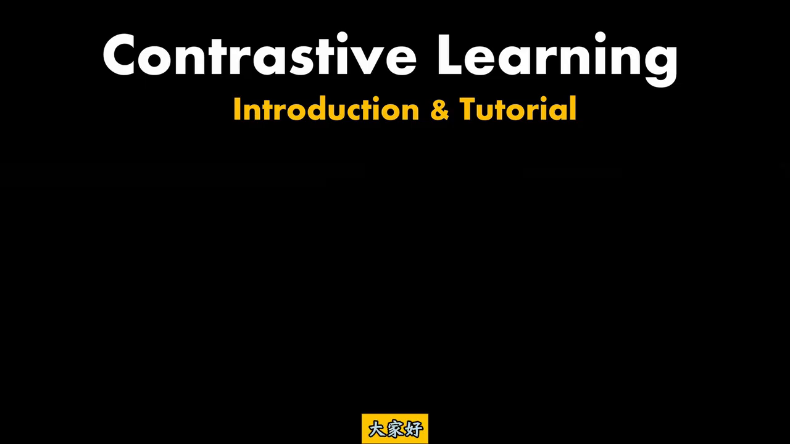
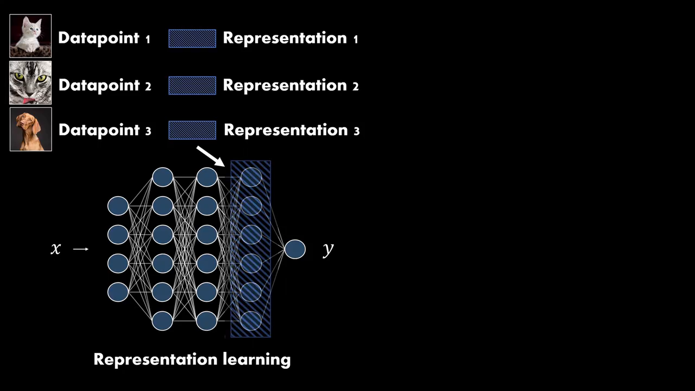
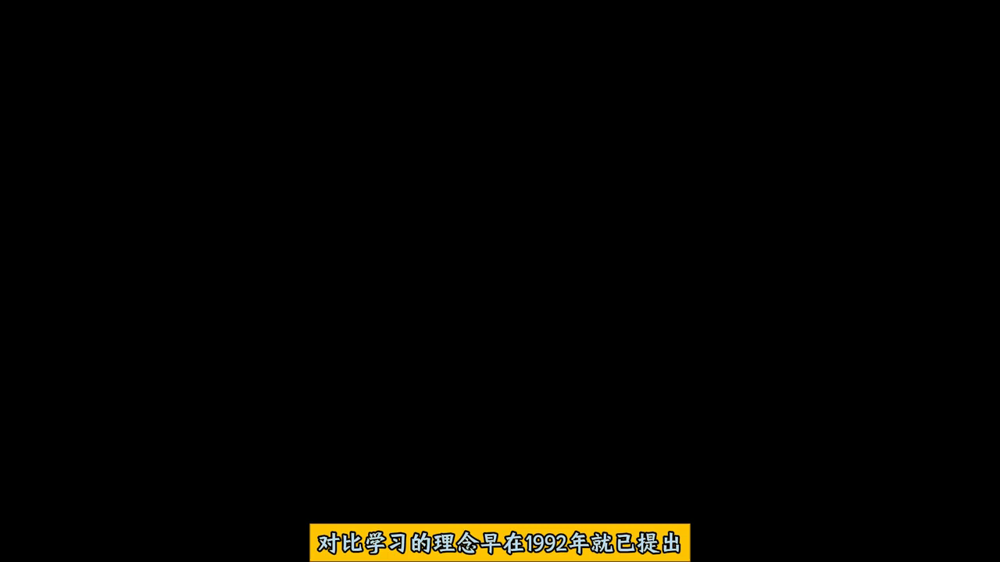
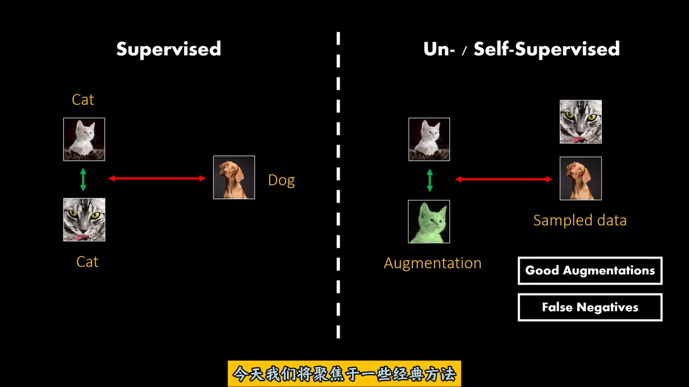
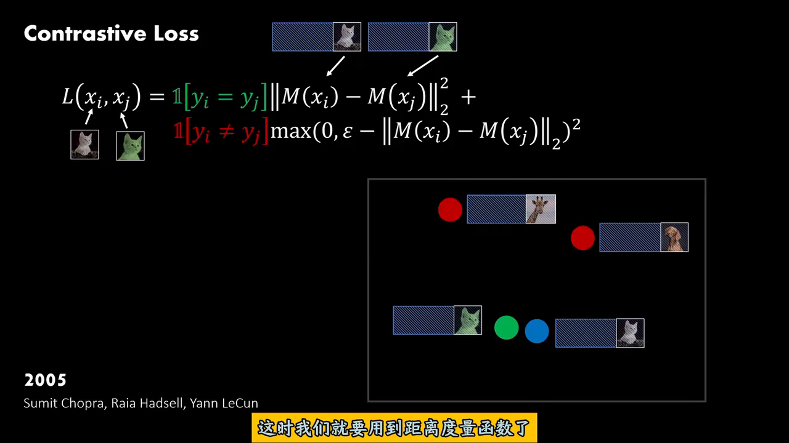
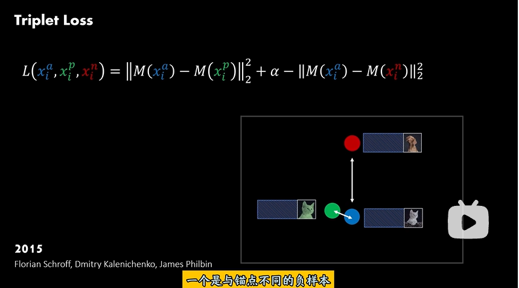
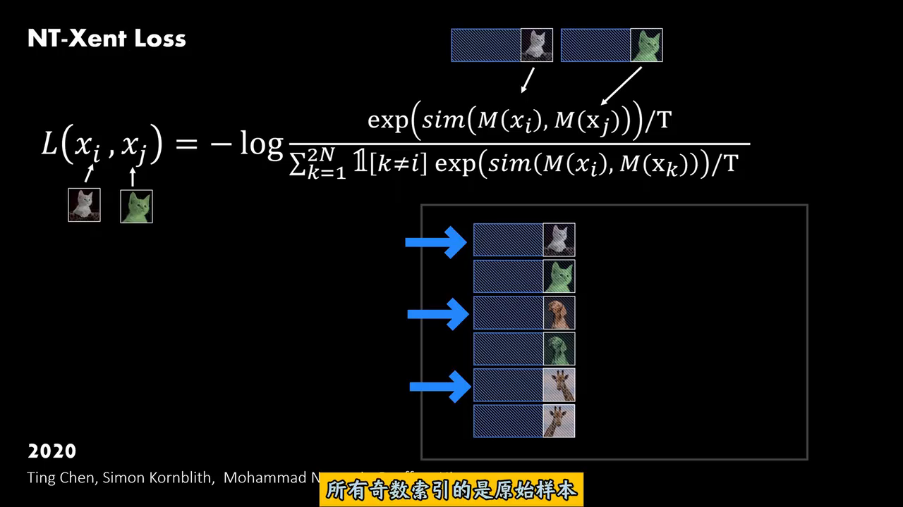
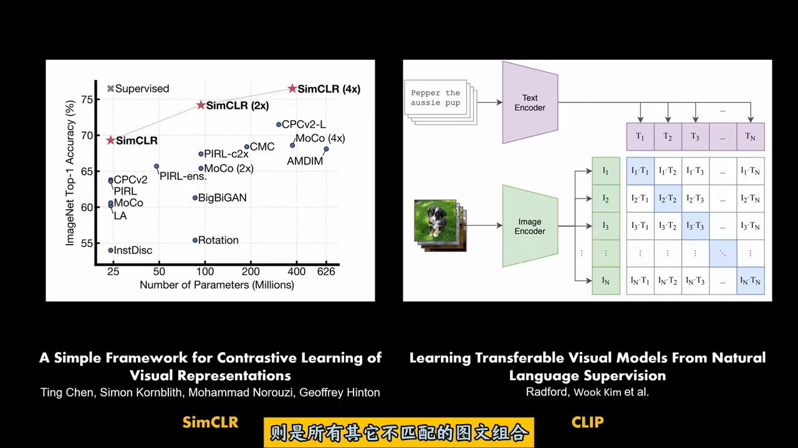
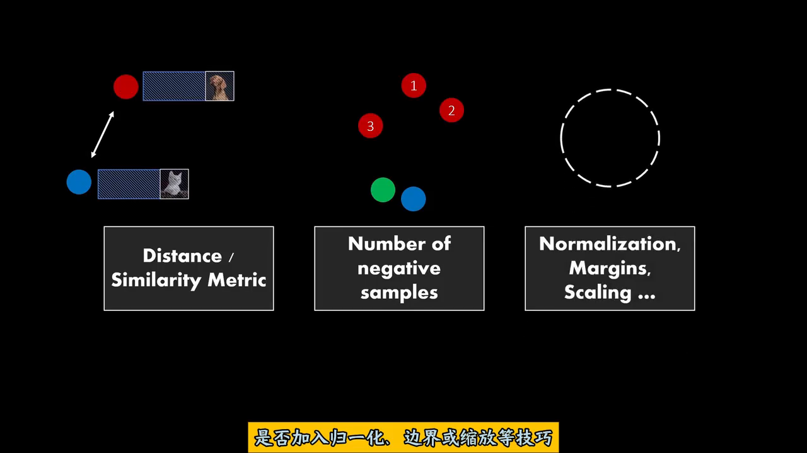

> **这篇笔记在干什么**：视频《对比学习有多猛？监督学习：你礼貌吗？》(原名 Contrastive Learning: Introduction & Tutorial 的中译版) 开场就直接甩出"表征""嵌入空间"这类词，默认观众已经会了。这篇笔记把这些被跳过的前置概念逐个补上，再顺着视频的时间线把三代对比损失公式里的每个符号读成人话。所有配图均为该视频的原帧截图（720p）。

## 0. 一页速览表

| 术语 | 英文 | 一句人话 | 视频出现处 |
| --- | --- | --- | --- |
| 表征 | Representation | 把数据改写成一串数字（向量）的"描述方式"；好表征只留任务有用的语义 | 00:35 |
| 向量 / 维度 | Vector / Dimension | 一排数；维度 = 这排数有几个 | 00:35 |
| 嵌入 | Embedding | 把原始数据"塞进"向量空间这个动作，以及塞进去后得到的那串数 | 00:40 |
| 嵌入空间 | Embedding Space | 所有嵌入向量住的向量空间：语义相似的东西在里面挤成一团 | 00:40 |
| 表征学习 | Representation Learning | 不手工设计特征，让网络自己学出好表征 | 00:40 |
| 编码器 | Encoder / M(·) | 负责"输入 → 嵌入向量"映射的那个网络，公式里的 M | 06:20 |
| 监督学习 | Supervised | 标签由人给：这张是猫、那张是狗 | 02:20 |
| 自监督学习 | Self-Supervised | 标签从数据自己里造：同一张图增强出两份，天然是一对正样本 | 02:20 |
| 数据增强 | Augmentation | 对同一张图裁剪 / 调色 / 翻转，造出它的"双胞胎" | 02:28 |
| 正 / 负样本对 | Positive / Negative Pair | 要被拉近的一对 / 要被推开的一对 | 02:20 |
| 假负样本 | False Negative | 其实同类、却被当负样本推开的倒霉样本 | 02:28 |
| 孪生网络 | Siamese Network | 两份权重完全相同的网络并联处理两个输入，比输出是否一致 | 03:20 |
| 损失函数 | Loss | 给网络这次表现打的分，分数越低越好，训练就是拼命降它 | 05:20 |
| 指示函数 | 𝟙[·] | 开关：方括号里条件成立取 1，否则取 0 | 06:20 |
| 欧氏距离 | ‖u − v‖₂ | 空间里两点间的直线距离，越小越像 | 06:20 |
| 余弦相似度 | sim(u, v) | 两个向量方向有多一致，取值 [−1, 1]，越大越像 | 09:20 |
| 间隔 | Margin (ε, α) | 对负样本要求的"最少距离"：够远了就不再罚，别浪费力气 | 06:20 / 07:00 |
| 锚点 | Anchor | 三元组里当作参照物那一个样本，上标 a | 07:00 |
| 温度 | Temperature (T) | NT-Xent 里控制 softmax 尖锐程度的旋钮：小 T 盯难样本 | 09:20 |
| 归一化 | Normalization | 把向量缩到统一规格（这里指 L2 归一化成单位长度） | 10:20 |
| 患者特异性噪声对比损失 | Patient-specific Noise Contrastive Loss | ECG 案例：按单个患者的分布造对比损失，捕捉个体化生理特征 | 案例拓展 §7.2 |
| CMSC / CMLC / CMSMLC | Contrastive Multi-Segment / Multi-Lead / Multi-Segment-Multi-Lead Coding | CLOCS 的三种 ECG"增强"：截时间段 / 换导联组合 / 两者叠加 | 案例拓展 §7.1 |
| Chapman 数据集 | Chapman Dataset | 大规模多标签心电数据集，心律失常分类常用基准 | 案例拓展 §7.4 |
| AUC | Area Under the Curve | ROC 曲线下面积 ∈ [0,1]，不怕类别不平衡，越接近 1 越好 | 案例拓展 §7.4 |
| NCE | Noise Contrastive Estimation | 靠"分清真样本与噪声"来学习，InfoNCE / NT-Xent 的理论源头 | 案例拓展 §7.2 |

## 1. 视频与使用说明

<iframe width="100%" height="468" src="//player.bilibili.com/player.html?bvid=BV1D38wzmEEP&p=1" scrolling="no" border="0" frameborder="no" framespacing="0" allowfullscreen="true"> </iframe>

- 视频：《对比学习有多猛？监督学习：你礼貌吗？》，UP 主 AI算法工程师Power，BV1D38wzmEEP，时长 10:40。
- 阅读顺序：第 2–5 节补前置概念（视频默认你会的部分），第 6 节顺视频时间线读公式，第 7 节看同一套框架在心电信号上的定制落地（案例拓展），第 8–9 节收尾对比，附录纠错。
- 文中时间戳（如 06:20）对应视频进度条，方便回看。


*图 1　视频标题页。注意右边圆圈里的画面：两把椅子（扶手椅、办公椅）的点挤成紫色和橙色两团，汽车单独是蓝色一团——这张图就是"嵌入空间"的全部直觉，第 3 节展开。*

## 2. 表征（Representation）：数据的"另一张身份证"

**人话**：一张猫的 jpg 在计算机里只是一百多万个像素值，这些数字本身不告诉任何人"这是猫"。**表征 = 换一种对任务更有用的方式来描述同一份数据**，通常写成一行数字（向量），例如 128 维向量就是 128 个数排成一排。

生活类比：认识一个人可以靠"本人"，也可以靠他的档案：身高、体重、职业、笔迹……档案不是本人，但好的档案足以让你在一群人里认出他。表征就是数据交给算法的"档案"。

- 同一份数据可以有无数种表征：像素值是一种、"耳朵尖不尖、有无胡须"是一组手工特征、网络学到的一串数是另一种。**表征有好坏**：好表征把"对任务重要的差异"放大，把无关差异（背景、光照）抹掉。
- 视频 00:35 的画面里，三张猫狗图（Datapoint 1/2/3）右边各跟着一根蓝色斜纹长条，那就是它们各自的 Representation——一根长条 = 一个向量。
- 下游任务（分类、检索、聚类）吃的都是表征，不是原始像素。所以"学一个好表征"本身就成了一个独立课题，即表征学习（第 4 节）。

**和"特征 (feature)"的区别**（附录 B 有纠错表）：feature 更偏向"单个可测量的量"或手工设计描述子；representation 强调"为任务学出来的一整套描述"。日常混用问题不大，但读论文时要知道后者是学出来的。

## 3. 嵌入与嵌入空间（Embedding / Embedding Space）：把"像不像"变成"近不近"

**嵌入**：把离散或原始的对象（一个词、一张图）映射成连续向量空间里一个点的过程，以及得到的那个向量。词嵌入（word2vec）、图嵌入、图像嵌入都是同一套路。

**嵌入空间**：所有嵌入向量共同生活的那个向量空间。叫"空间"是因为它带几何：可以量距离、量夹角，于是**语义相似 ⇔ 几何相近**这条约定才有意义。


*图 2　视频 00:40 原帧。左：Datapoint → Representation（蓝条）；中：神经网络把输入 x 逐层变换，高亮的那一列神经元激活值就是表征（表征学习，第 4 节）；右：Embedding Space（嵌入空间），相似样本的点聚成团。*

读图 1 的圆圈：紫色团 = 扶手椅们，橙色团 = 办公椅们，蓝色团 = 汽车们。**同类挤在一起、异类离得远**——这不是画师的审美，而是对比学习训练目标的字面意思（第 6 节：正的拉近、负的推开）。训练完成后，"两张图像不像"就可以直接查"两点近不近"，检索、聚类、分类全都建立在这一点上。

两个容易卡住的点：

- **维度**：嵌入空间比如是 128 维，意思是每个向量 128 个数。别试图在脑内画 128 维——视频里的二维圆圈只是示意（真实高维空间通常用 t-SNE / UMAP 降维后才画得出来）。
- **嵌入 vs 降维**：PCA 也把人数据变少，但它不是"语义嵌入"：嵌入强调由学习得到、且保持语义结构（相似的近、不相似的远），降维只要求信息损失小。

## 4. 表征学习与编码器：表征是谁造出来的？

**表征学习**：传统流程里特征靠人设计（SIFT、HOG……）；表征学习把这一步交给模型——端对端地训一个网络，**取中间某一层的激活值当表征**。图 2 中间那张网络图里，被框出来高亮的一列就是"我们想要的表征"：输入 x 经过若干隐藏层后在这一列"成像"，再往后才是任务输出 y。

对比学习的立场很 radical：**y 我不要了，我只要那一列**。训练信号改成"相似样本的表征要接近"（第 5、6 节），训完把最后一层扔掉，中间列拿走即用。

**编码器 / M(·)**：第 6 节所有公式里的 M(x) 就是"把 x 映射成表征向量"的这个网络（图 2 中从 x 到高亮列的部分）；在 SimCLR / CLIP 的论文图里它叫 Encoder（图 5 右侧的 Text Encoder / Image Encoder 两个梯形）。M 可以是 CNN、Transformer，无所谓——对比学习是一套"怎么训"的原则，不绑定骨架。


*图 3　视频 03:20 原帧：对比学习的思想源头之一，Becker & Hinton 1992。两个结构相同、权重共享的分支分别吃 input A / input B，训练目标是 maximize agreement（让两个输出尽量一致）——这就是孪生网络 (Siamese Network) 与"正样本拉近"的最早形态。*

## 5. 正负样本从哪来：监督 vs 自监督

对比学习的全部训练信号只有一句话：**正的拉近、负的推开**。于是第一个问题就是：谁告诉我哪两个是"正"？


*图 4　视频 02:28 原帧。左半 Supervised：两张猫图因标签相同而互为正样本（绿双向箭），与狗图互为负样本（红双向箭）。右半 Un-/Self-Supervised：没有标签，把同一张猫图做增强（Augmentation，变成绿色那张）得到"免费"的正样本对；批内其它图（包括另一只猫）都当负样本。右下角两个关键词：Good Augmentations、False Negatives。*

- **监督 (Supervised)**：正负关系由人类标签给定（图 4 左）。好处是关系准；坏处是标签贵。
- **自监督 (Self-Supervised)**：标签从数据自身造。对同一张图做两次**数据增强**（随机裁剪、颜色抖动、翻转……）得到两个"视图 (view)"，它俩天然同义 → 免费正样本对（图 4 右）。于是无标注数据也能海量训练，这是 2020 年后对比学习爆发的根本原因。
- **Good Augmentations**：增强必须"换个样子但不变意思"。把猫图裁到只剩尾巴，正样本对就名存实亡了。增强策略实际上定义了"模型应当对哪些变化保持不变"（即不变性，invariance）。
- **False Negatives（假负样本）**：自监督把批内其它图一律当负样本，可万一另一张图也是猫呢？它和锚点同类却被硬推开——这就是假负样本，是自监督对比学习的系统性噪声。视频 01:20 引用的 Khosla et al. 2021（Supervised Contrastive Learning）正是在说：有标签时把"同类"从负样本里赦免掉，嵌入表征会更好（表格里 mCE 更低）。
  - 顺带解释表格列名：**mCE** = mean Classification Error，多个数据集上的平均分类错误率，越低越好；**rel. mCE** 是相对基线 (AlexNet + Cross-Entropy = 100.0) 的比值。

## 6. 三代对比损失：把公式里每个符号读成人话

### 6.1 Contrastive Loss（2005，Chopra / Hadsell / LeCun）


*图 5　视频 06:20 原帧。上方：两只猫的表征要被拉近；公式第二项管负样本：距离不足 ε 才罚。右下小图：绿点蓝点（正对）贴在一起，红点（负样本）被推远。*

```text
L(xᵢ, xⱼ) = 𝟙[yᵢ = yⱼ] · ‖M(xᵢ) − M(xⱼ)‖₂²
          + 𝟙[yᵢ ≠ yⱼ] · max(0, ε − ‖M(xᵢ) − M(xⱼ)‖₂)²
```

逐项翻译：

- `M(xᵢ)`：样本 xᵢ 的嵌入向量（编码器输出）。
- `‖u − v‖₂`：欧氏距离，空间里两点直线距离；平方是让它光滑好求导。
- `𝟙[条件]`：指示函数，开关。条件真 = 1，假 = 0。于是**一对样本只触发两项中的一项**：是正对就只罚"不够近"，是负对就只罚"不够远"。
- `yᵢ`：样本标签——注意 2005 年版是**监督**的，正负由标签定。
- `ε`（margin，间隔）：对负样本的距离要求线。`max(0, ε − d)` 的意思：负对距离 d 已经 ≥ ε 时这一项 = 0，**够远了就下班**，不再浪费梯度去无限推远；只有 d < ε 才罚差额。margin 不是分类边界，是"容忍下限"。

### 6.2 Triplet Loss（2015，Schroff / Kalenichenko / Philbin，FaceNet）


*图 6　视频 07:00 原帧。蓝点 = 锚点 xᵃ，绿点 = 正样本 xᵖ，红点 = 负样本 xⁿ：要求"锚–正"距离至少比"锚–负"距离小 α。*

```text
L(xᵢᵃ, xᵢᵖ, xᵢⁿ) = max(0, ‖M(xᵢᵃ) − M(xᵢᵖ)‖₂² − ‖M(xᵢᵃ) − M(xᵢⁿ)‖₂² + α)
```

（视频幻灯写成 `‖M(xᵃ)−M(xᵖ)‖² + α − ‖M(x)−M(xⁿ)‖²`，与外面套 max(0, ·) 的常见写法等价。）

- 上标 `a / p / n` = **anchor（锚点）/ positive / negative**。一次看三个样本：以锚点为参照，正的必须比负的近至少 α。
- `α` 仍是 margin，只是这次作用于"距离差"。
- 相对 6.1 的变化：负样本从"配对出现"变成"每个三元组带一个"，训练效率取决于**三元组怎么挑**——随便挑的大多数三元组早就满足约束（loss = 0），不产生梯度，所以 FaceNet 原文强调要挖"难三元组 (hard triplet mining)"。这个痛点直接催生了下一代"一次看全 batch 负样本"的做法。

### 6.3 NT-Xent（2020，SimCLR，Chen / Kornblith / Norouzi / Hinton）


*图 7　视频 09:20 原帧。蓝点 xᵢ 与绿点 xⱼ 是同一张图的两次增强（正对）；分母把批内其余 2N−2 个向量全当负候选。字幕：NT-Xent 全称"归一化温度缩放交叉熵损失"。*

```text
                 exp( sim(M(xᵢ), M(xⱼ)) / T )
L(xᵢ, xⱼ) = −log ────────────────────────────────────────
                 Σₖ₌₁²ᴺ 𝟙[k ≠ i] · exp( sim(M(xᵢ), M(xₖ)) / T )
```

把它读成一道**选择题**就懂了：把 xᵢ 的正样本 xⱼ 混进 2N−1 个候选里，让模型认出哪个是正——认出正样本的概率就是上面那个分式（softmax），取负对数就是交叉熵。名字里的三个词各对应一处：

- **Cross Entropy（交叉熵）**：即上面这道选择题的分类损失。
- **Temperature-scaled（温度缩放）**：`sim / T` 里的 T。T 小 → 除完差距被放大 → softmax 更尖 → 损失盯着最像正样本的那几个"难负样本"打；T 大 → 分布平滑、一视同仁。T 是超参数（SimCLR 取 0.5 左右），**和学习率无关**。
- **Normalized（归一化）**：算 sim 之前先把向量 L2 归一化成单位长度，于是 `sim(u, v) = u·v / (‖u‖‖v‖)` 退化为点积，即余弦相似度，取值 [−1, 1]。注意此"归一化"是**逐向量缩放**，不是 BatchNorm。
- `2N`：batch 里 N 张图各增强出 2 个视图，共 2N 个向量；`𝟙[k ≠ i]` 把 xᵢ 自己从分母里剔掉。负样本数从 1 个（6.1/6.2）暴涨到 2N−2 个，正是 SimCLR 用大 batch 换性能的原因。

顺带：NT-Xent 与 InfoNCE（CPC 一文提出）形式同源，很多文献里混用；MoCo 则是用"队列字典"解决负样本不够多的另一条路线。

### 6.4 CLIP：把负样本换成"配错的图文对"


*图 8　视频 04:20 原帧。左：SimCLR 的规模效应（模型越大、数据越多，ImageNet Top-1 越高）；右：CLIP 的结构——文本编码器与图像编码器各产出 Tᵢ / Iᵢ 向量，N×N 相似度矩阵里对角线是配对图文（正），其余 N²−N 个格子全是负样本。*

CLIP（Radford et al. 2021）把 6.3 的框架原样搬到跨模态：正对 = 同一对(图, 文)，负对 = 批内所有配错的图文组合。因为"正负关系是已知的"（字幕原话：图文天然配对），不需要任何人工标签，4 亿网络图文对直接开训——这就是"自监督/弱监督"威力的放大版。

## 7. 案例拓展：同一套套路搬上心电图（CLOCS）

前六节是"通用框架"：增强造正对、损失拉近推远。本节用一个医学信号案例——Kiyasseh 等人的 **CLOCS**（Contrastive Learning of Cardiac Signals Across Space, Time, and Patients）——看"增强、正负、损失"三件套在心电图（ECG）这种特殊信号上怎么被重新设计。内容整合自案例科普材料，术语与 §5–6 的通用概念一一对应。

| 通用框架（§5–6） | CLOCS 的 ECG 落地 |
| --- | --- |
| 数据增强 Augmentation 造视图 | 三种变换：截时间段（CMSC）/ 换导联组合（CMLC）/ 两者叠加（CMSMLC） |
| 正样本对 = 同一张图的两次增强 | 同一段心电记录的不同时间段 / 不同导联 |
| 负样本 = 批内其它图 | 其它记录、其它患者的信号 |
| NT-Xent / InfoNCE 损失 | 患者特异性噪声对比损失 |
| 下游评测（ImageNet 等） | Chapman 等带标签数据集上的心律失常分类 AUC |

### 7.1 ECG 为什么要定制增强：三种变换

图像的增强（裁剪、颜色抖动）搬到心电上不好使：ECG 的"语义"藏在**时间维的心律**和**十二导联的空间向量**里。于是 CLOCS 设计了三种"换观察窗口"的变换，作为 ECG 版数据增强：

- **CMSC（Contrastive Multi-Segment Coding，对比多段编码）**：从同一份长时心电中截取不同时间段（Segment）作视图。目的：让模型学习同一个人在不同时间点的心律一致性，忽略短期的随机噪音。
- **CMLC（Contrastive Multi-Lead Coding，对比多导联编码）**：利用 12 导联中不同的导联组合做视图。目的：学习心脏电活动在不同空间角度（导联）下的相关性；即使某个导联信号弱，其他导联也能提供互补信息。
- **CMSMLC（Contrastive Multi-Segment Multi-Lead Coding，对比多段多导联编码）**：时间 × 空间同时上，既看不同时间段又看不同导联。目的：最全面的视角，强制模型同时掌握心律的时间演变规律和空间向量特征。

一句话本质：图像增强是"**换个样子但不变意思**"；ECG 三变换是"**换个观察窗口（时间/空间）但不变这个人**"——§5 说的不变性 (invariance)，在这里从"光照、角度"换成了"时间段、导联"。

### 7.2 患者特异性噪声对比损失（Patient-specific Noise Contrastive Loss）

- **痛点**：传统对比损失假设所有"非自身"样本都是负样本。但心电上这条假设特别脆：不同患者可能有相似的病理特征（本该接近却被硬推开 = 学错），同一患者在不同时间的心电图又差异很大（本该拉开却难拉近）。
- **解法**：损失函数专门针对**单个患者的数据分布**做优化（技术谱系上是噪声对比估计 NCE 一族，即 §6.3 里 InfoNCE / NT-Xent 的亲戚）：更精细地衡量当前样本与该患者其他样本之间的相似度，从而准确捕捉**个体化的生理特征**，而不是被群体平均特征淹没。
- **与 §5 的呼应**：这正是"假负样本"问题的 ECG 版——同患者同病理的样本在语义上近乎正样本，却在结构上被当负样本；患者特异性损失就是承认并修正这种结构。

### 7.3 结果：以 SimCLR 为基线，高出 15.8%

SimCLR（§6.3）是对比学习里最常用的通用基线 (Baseline)。CLOCS 靠上面这些针对 ECG 的定制设计，在 Chapman 数据集的下游任务上比 SimCLR 高出 **15.8%**（案例材料口径；原文 Kiyasseh et al., CLOCS）。看点：提升不来自更大的 backbone，而来自**把领域知识注入"增强"和"损失"两个旋钮**——正是 §8 那三个设计旋钮的落地形态。

### 7.4 两个评测名词：Chapman 数据集与 AUC

- **Chapman 数据集**：大规模、高质量的**多标签**心电图数据集，常用于评估心律失常分类模型。在它上面取得高 AUC，证明模型具有很强的临床泛化能力。
- **AUC（Area Under the Curve，曲线下面积）**：ROC 曲线下的面积，取值 [0, 1]，越接近 1 越好；是衡量二分类 / 多标签分类性能最稳健的指标之一，尤其适合**类别不平衡**的数据（医疗数据常态：患病样本远少于健康样本）。
- 一句直觉：AUC = "随机抽一个正样本一个负样本，模型给正样本打分更高"的概率；与阈值无关、不受类别比例影响，比准确率 (accuracy) 可靠。"高出 15.8%"意味着诊断可靠性质的飞跃。

## 8. 收尾：视频给的三个"设计旋钮"


*图 9　视频 10:20 原帧，全片总结：Distance / Similarity Metric、Number of negative samples、Normalization, Margins, Scaling …*

- **距离 / 相似度度量**：用欧氏距离（6.1、6.2）还是余弦相似度（6.3）？度量决定了"近/像"的定义本身。
- **负样本数量**：1 个（contrastive / triplet）→ 全 batch 2N−2 个（NT-Xent）→ N²−N 个（CLIP 的矩阵）。负样本越多，"推开"信号越密，通常也越吃显存。
- **归一化、间隔、缩放**：单位长度归一化（配余弦）、margin ε/α（配欧氏）、温度 T（配 softmax）——三者都是"罚多狠、罚到哪儿为止"的旋钮。

三代损失看似三个公式，其实是这三个旋钮的不同拧法。

## 9. 对比表收尾

| 维度 | Contrastive Loss (2005) | Triplet Loss (2015) | NT-Xent (2020, SimCLR) |
| --- | --- | --- | --- |
| 样本组织 | 成对 (pair) | 三元组 (anchor, pos, neg) | 全 batch：2N 个视图，1 正 vs 2N−2 负 |
| 正样本来源 | 同标签（监督） | 同标签（监督） | 同一张图的两次增强（自监督） |
| 度量 | 欧氏距离 | 欧氏距离 | 余弦相似度（向量先 L2 归一化） |
| "够了就停"机制 | margin ε | margin α | 温度 T 的 softmax（无硬 margin） |
| 每步负样本数 | 1 | 1 | 2N−2（大 batch 是关键） |
| 损失形态 | 距离 + hinge | 距离差 + hinge | 分类交叉熵（选择题） |
| 代表应用 | 孪生网络验证 | FaceNet 人脸识别 | SimCLR / MoCo / CLIP 一系 |
| 主要痛点 | 需标签；负样本少 | 难三元组挖掘 | 吃 batch / 显存；假负样本 |

## 附录 A：视频里闪过的名字速查

| 名字 | 是什么 |
| --- | --- |
| Siamese Network（孪生网络） | 共享权重的双分支网络，比两输出一致性；1992 年 Becker & Hinton 起 |
| FaceNet | 2015 谷歌人脸识别系统，Triplet Loss 出处 |
| SimCLR | 2020 谷歌，NT-Xent + 大 batch 自监督对比框架 |
| MoCo | 2020 Facebook，用动量编码器 + 队列字典存负样本 |
| CLIP | 2021 OpenAI，图文对比，4 亿图文对弱监督 |
| InfoNCE | CPC 一文提出的噪声对比估计损失，与 NT-Xent 同源 |
| AlexNet / VGG / ResNet |  backbone（骨干网络）名，视频 01:20 表格里只是"用哪套网络"的差别 |
| mCE / rel. mCE | 平均分类错误率 / 相对基线的比值，越低越好 |
| t-SNE / UMAP | 把高维嵌入画到二维纸面的降维可视化工具（视频圆圈图的画法来源） |
| CLOCS | Kiyasseh et al. 的心电对比学习框架（案例拓展 §7），含三种变换与患者特异性损失 |
| CMSC / CMLC / CMSMLC | CLOCS 的三种 ECG 变换：对比多段 / 多导联 / 多段多导联编码 |
| Chapman 数据集 | 大规模多标签心电数据集，常用于心律失常分类评估 |
| AUC | ROC 曲线下面积，∈ [0,1]，越高越好，对阈值与类别不平衡不敏感 |
| NCE | 噪声对比估计：靠"分清真样本与噪声"学习，InfoNCE / NT-Xent 的理论源头 |

## 附录 B：易错纠正表

| 常见误解 | 纠正 |
| --- | --- |
| 嵌入 = 降维 | 降维只求信息损失小（PCA）；嵌入要求**保持语义结构**（相似的近），且由学习得到 |
| 表征 = 特征 | 特征是单个可测量/手工量；表征是为任务学出的一整套向量描述（混用常见，读论文注意） |
| 温度 T 是学习率 | T 只作用于损失里的 softmax 尖锐度，是超参数，与优化器学习率无关 |
| margin 是分类边界 | margin 是"负样本距离的容忍下限"，够远即停罚，防止无限推远 |
| 归一化 = BatchNorm | NT-Xent 里指**逐向量 L2 归一化**成单位长度，与 BatchNorm 无关 |
| 自监督 = 无监督 | 无监督完全无标签（如聚类）；自监督是**自己造标签**（增强出正对），仍是有监督信号的训练 |
| 负样本 = 错误样本 | 负样本只是"与锚点不同义"，不是"错"；同类被误当负样本才叫假负样本 |
| 公式里可以不要 max(0, ·) | 去掉 hinge 后损失可为负、可无限刷低，"够远就停"的语义消失，训练会退化 |
| AUC 就是准确率 | AUC 是 ROC 曲线下面积 = 正样本得分高于负样本的概率，与阈值无关；准确率依赖阈值且会被类别不平衡骗 |
| 心电上"非自身"皆负样本 | 同患者同病理样本语义相近，当普通负样本硬推会学错 → 需要患者特异性损失 / 患者感知负采样 |
| +15.8% 靠模型更大 | 案例材料的结论：提升主要来自领域定制的增强与损失（§8 的旋钮），而非 backbone 规模 |

## 附录 C：公式速抄（Unicode 纯文本）

```text
余弦相似度   sim(u, v) = u·v / (‖u‖₂ ‖v‖₂)          ∈ [−1, 1]
Contrastive  L = 𝟙[yᵢ=yⱼ]·‖M(xᵢ)−M(xⱼ)‖₂² + 𝟙[yᵢ≠yⱼ]·max(0, ε−‖M(xᵢ)−M(xⱼ)‖₂)²
Triplet      L = max(0, ‖M(xᵃ)−M(xᵖ)‖₂² − ‖M(xᵃ)−M(xⁿ)‖₂² + α)
NT-Xent      L = −log( exp(sim(M(xᵢ),M(xⱼ))/T) / Σₖ₌₁²ᴺ 𝟙[k≠i]·exp(sim(M(xᵢ),M(xₖ))/T) )
```
