> **来源说明**：本文整理自 B 站用户 **initnation_** 的[视频笔记](https://www.bilibili.com/opus/1092343954475581442)，内容为视频 [【闪客】一小时从函数到 Transformer](https://www.bilibili.com/video/BV1NCgVzoEG9/)（UP 主：飞天闪客）合集前 6 P 的文字化记录，仅供个人学习使用，侵删。原笔记开头写道："闪客发了新的合集视频，所以我把之前每 p 的笔记搬过来合在一起，看起来方便一点。"

## 速览

| 项目 | 内容 |
| --- | --- |
| 视频 | 【闪客】一小时从函数到 Transformer（[BV1NCgVzoEG9](https://www.bilibili.com/video/BV1NCgVzoEG9/)，共 8 P，总长约 1 小时） |
| UP 主 | 飞天闪客（3Blue1Brown 中文） |
| 原笔记 | initnation_ · [bilibili opus](https://www.bilibili.com/opus/1092343954475581442)（2025-07-22 发布，覆盖前 6 P） |
| 主线 | 函数逼近 → 神经网络 → 损失/梯度下降/反向传播 → CNN → 词嵌入/RNN → Transformer 注意力 |
| 配图 | 31 张（存于同目录 `photo/` 文件夹） |

**章节地图**（点链接可直接跳到对应分 P）：

| 章节 | 对应视频 | 核心概念 |
| --- | --- | --- |
| 一、从函数到神经网络 | [P1 从函数到神经网络](https://www.bilibili.com/video/BV1NCgVzoEG9?p=1) | 符号主义、联结主义、激活函数、隐藏层、前向传播 |
| 二、如何计算神经网络的参数 | [P2 计算神经网络的参数](https://www.bilibili.com/video/BV1NCgVzoEG9?p=2) | 损失函数、均方误差、梯度下降、学习率、反向传播 |
| 三、一些问题和解决方法 | [P3 调教神经网络的方法](https://www.bilibili.com/video/BV1NCgVzoEG9?p=3) | 过拟合、泛化能力、数据增强、提前终止、正则化、Dropout |
| 四、矩阵表示和 CNN | [P4 从矩阵到 CNN](https://www.bilibili.com/video/BV1NCgVzoEG9?p=4) | 矩阵表示、全连接层缺点、卷积、卷积核、池化层、CNN |
| 五、循环神经网络 RNN | [P5 从词嵌入到 RNN](https://www.bilibili.com/video/BV1NCgVzoEG9?p=5) | 词嵌入、嵌入矩阵、潜空间、隐藏状态、RNN |
| 六、Transformer 架构 | [P6 简单而强大的 Transformer](https://www.bilibili.com/video/BV1NCgVzoEG9?p=6) | 位置编码、Q/K/V、注意力机制、多头注意力、编码器-解码器 |

## 视频

下面是官方嵌入播放器（默认从 P1 开始，播放器内可切换分 P；嵌入代码的写法见文末附录）：

<iframe  width="100%" height="468" src="//player.bilibili.com/player.html?isOutside=true&aid=114890442280099&bvid=BV1NCgVzoEG9&cid=31183339916&p=1" scrolling="no" border="0" frameborder="no" framespacing="0" allowfullscreen="true"></iframe>

## 一、从函数到神经网络

📺 对应视频：[P1 从函数到神经网络](https://www.bilibili.com/video/BV1NCgVzoEG9?p=1)

事实上函数就是一种变换，对数据进行变换得到我们所需要的结果。

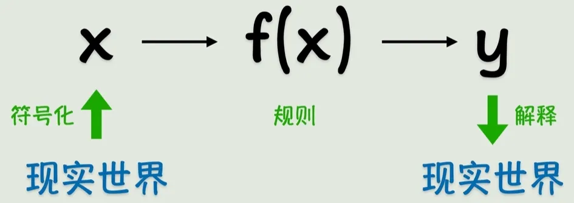

*图 1：函数就是一种变换——输入经过"机器"变换，得到我们想要的输出*

早期的人工智能 → **符号主义**，即用精确的函数来表示一切。但是很多时候，我们没办法找到一个精确的函数来描述某个关系，退而求其次选择一个近似解也不错，也就是说函数没必要精确地通过每一个点，它只需要最接近结果就好了，这就是**联结主义**。

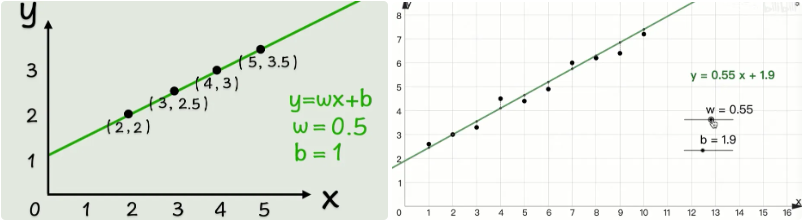

*图 2：联结主义——函数不必穿过每个点，只要整体最接近数据即可*

但是当数据稍微变化一下，出现曲线的时候，简单的线性函数就没办法解决这个问题了。那我们的目标就是将线性函数转为非线性函数，这可以通过套一个非线性函数来做到，比如平方、正弦函数、指数函数。这就是**激活函数**。

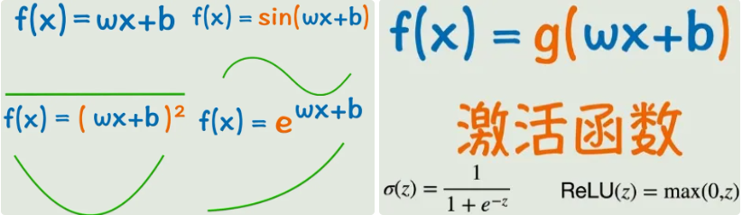

*图 3：激活函数——在线性变换外面套一个非线性函数（平方、正弦、指数等）*

这还不够，正常情况下我们不会只有一个输入，并且只有一个激活函数可能不会达到理想的结果，所以开始嵌套！

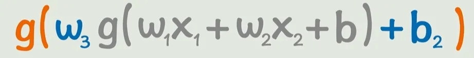

*图 4：多个输入 + 激活函数不断嵌套*

像这样多个输入，激活函数外面加一次线性变换，再套一个激活函数，并且还可以不断嵌套。通过这样的方式，我们可以构造出非常复杂的关系，理论上可以逼近任意的连续函数。

但这样看起来太复杂了，所以我们引入神经元的概念，图中的一个小圈就是一个神经元，多个神经元互相连接形成的网状结构就叫做**神经网络**。同时我们可以看到随着函数式子的嵌套，神经网络也在拓展，原本的输出成为了**隐藏层**：位于输入层和输出层之间的中间层。隐藏层的主要作用是对输入数据进行复杂的特征提取和变换。

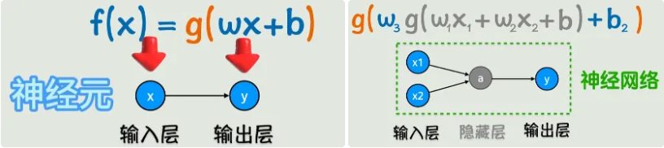

*图 5：函数嵌套的图形化表示——神经元、输入层、隐藏层、输出层*

从神经网络的图示来看，就像是一个信号从左向右传播的过程，这个过程就叫做神经网络的**前向传播**。并且神经网络的层数和每一层的神经元都可以叠加，这样就可以构成一个非常复杂的非线性函数。看起来复杂，但是我们的目标还是一开始说的：找到一个近似解，也就是根据已知的 x、y 猜出所有的 w 和 b。

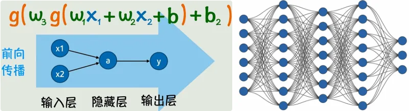

*图 6：前向传播——信号从左向右逐层传播*

## 二、如何计算神经网络的参数

📺 对应视频：[P2 计算神经网络的参数](https://www.bilibili.com/video/BV1NCgVzoEG9?p=2)

那么如何计算 w 和 b 呢？首先明确我们需要的 w 和 b 能够让函数的结果更接近真实数据。对于以下数据，我们可以看出显然第一个拟合得更好。

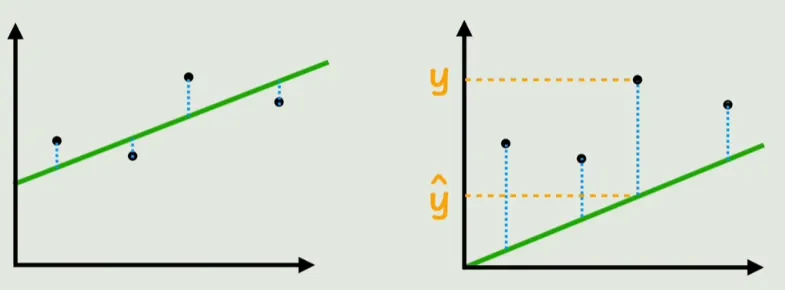

*图 7：两种拟合结果对比——左边的误差线段更短，拟合更好*

用预测值减去真实值，再套上绝对值，就可以表示一个点的预测数据和真实值的误差。为了评估整体的拟合效果，我们将这些线段的长度相加，这样就得到了预测数据与真实数据的总的差异。这个函数就叫做**损失函数**：表示预测数据与真实数据误差的函数。对图中的函数进行改造，去掉绝对值进行平方，再根据样本数量进行平均化，就得到了"均方误差"（损失函数的一种）。把损失函数记为 L，从参数的视角看，L 就是一个关于 w、b 的函数。

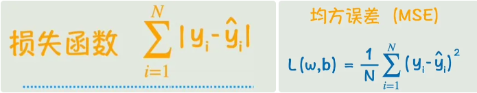

*图 8：损失函数——误差之和；去绝对值改平方再平均，即均方误差*

损失函数表示的是预测值与真实值的误差，而我们的目标就是让误差最小，也就是可以让损失函数 L 最小的 w 和 b。

参数很少的时候或许可以用"令偏导数等于 0"来求得损失函数最小时的 w 和 b。通过寻找一种线性函数来拟合 x 和 y 的关系，就是机器学习中最基本的一种分析法：线性回归。

但神经网络通常是非常复杂的非线性函数，它的损失函数一般也非常复杂。这时候我们采用的办法为：**梯度下降**。

调整 w 的值（增大），如果损失函数增大，我们就反向调整 w。就这样不断调整 w 和 b（所有参数）使得损失函数不断减小。而损失函数 L 随着参数 w 变化而变化的程度，其实就是损失函数对 w 的偏导数。而我们要做的，就是让 w 和 b 不断地向偏导数的反方向去变化。具体变化的快慢，我们再增加一个系数（**学习率**）来控制。这些偏导数所构成的向量就叫做**梯度**。不断变化 w 和 b 使得损失函数不断减小，进而求出最后的 w 和 b，这个过程就叫做梯度下降。

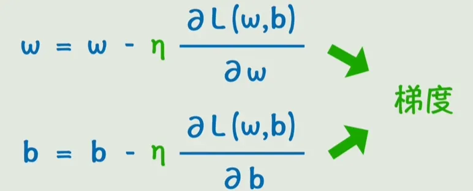

*图 9：梯度下降——参数沿梯度（偏导数向量）的反方向一步步下山，步长由学习率控制*

现在我们的问题就变成了如何求偏导数了。用一个简单的例子来说明。要求 L 对 w1 的偏导，只需要用链式法则分别求图中的三个偏导，再相乘就好了。而由于我们可以从右向左计算这些偏导数，然后调整每一层的参数，计算前一层的时候用到的偏导数的值，后面也会用到（更左边的层），所以可以让这些值从右向左传播，这个过程就叫做**反向传播**。

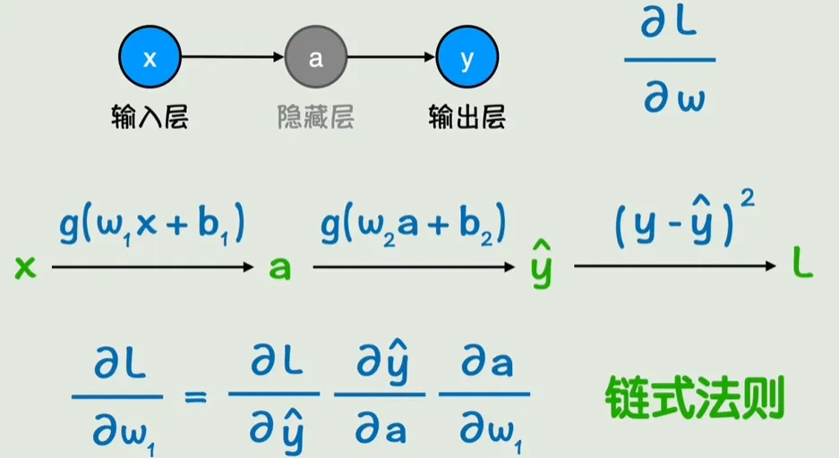

*图 10：反向传播——用链式法则从右向左逐层计算偏导数并复用*

小结：我们通过前向传播根据输入 x 计算输出 y，再根据反向传播计算损失函数关于每个参数的梯度，每个参数都向梯度的反方向变化一点，这个就是神经网络的一次训练。经过多轮训练使得损失函数足够小，就得到了我们想要的函数。

## 三、一些问题和解决方法

📺 对应视频：[P3 调教神经网络的方法](https://www.bilibili.com/video/BV1NCgVzoEG9?p=3)

现在假设我们用训练数据成功训练了一个神经网络，还有可能出现哪些问题呢？

### 过拟合与泛化能力

所谓**过拟合**，就是模型太复杂了，在学习数据时把噪声和随机波动也学会了，这样对新数据的预测能力甚至不如简单的线性模型。而在没见过的数据上的表现能力，就是**泛化能力**。

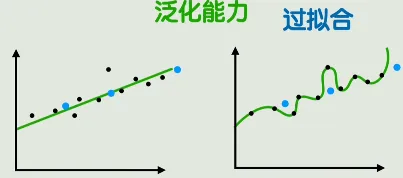

*图 11：过拟合——曲线为了穿过每个点而扭曲，泛化能力反而变差*

那我们该怎么解决过拟合呢？很简单，模型太复杂了，那我们就选一个简单一点的模型。与此相对，也可以通过增加训练数据的量来解决这个问题。数据越充足，模型越不容易过拟合。

那如何获得更多的数据呢？如果没有办法直接收集更多数据，可以选择对现有的数据进行处理（图像旋转、镜像、滤镜、裁剪），就可以得到更多数据，还可以让模型的鲁棒性更强，不会因为输入的一点波动而产生很大的结果差异。

### 提前终止与正则化

还有没有其他办法来避免过拟合呢？有的兄弟，有的。

神经网络的训练通过调整参数来让模型逼近真实数据，如果模型在向着过拟合的方向发展，那我们停止训练就好了，这样也能一定程度上避免过拟合。

但显然，这方法还是太粗糙了，有没有更精细的方法呢？有的兄弟，有的。

我们只需要在原来的损失函数的基础上加上被调整参数本身，这样当参数调整让损失函数减小的幅度甚至不如参数本身增大的幅度，新的损失函数就是增大的，这次调整显然就是不合适的（左图）。

除了加上参数本身之外，我们还可以加上参数的平方和，这样在参数大的时候，抑制的效果就更强了。我们加上的这一项就叫做**惩罚项**。把通过向损失函数中添加权重惩罚项来抑制参数野蛮增长的方法叫做**正则化**。惩罚项的力度则由**正则化系数**来控制。以上这些控制参数的参数叫做**超参数**。

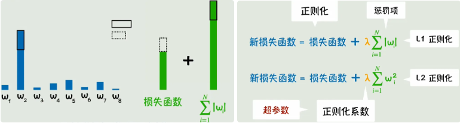

*图 12：正则化——损失函数加上参数本身或其平方和作为惩罚项，抑制参数野蛮增长*

### Dropout

除此之外，我们当然还有别的方法：Dropout。

为了避免模型过于依赖某些参数，我们在每次训练时都随机丢弃掉一部分参数就好了。

### 其他遗留问题

很好，现在我们了解了如何避免过拟合，那我们是否能训练出一个非常好的神经网络了呢？不，还有很多问题：


*图 13：训练中仍然存在的四类问题及对应解决办法（下表为原图转写）*

| 问题 | 表现 | 常见解决办法（原图转写） |
| --- | --- | --- |
| 梯度消失 | 网络越深，梯度反向传播时越来越小，参数更新困难 | 用残差网络防止深层网络的梯度衰减 |
| 梯度爆炸 | 梯度数值越来越大，参数的调整幅度失去控制 | 用梯度截断防止梯度的更新过大；用合理的权重初始化和输入数据归一化让梯度分布更加平滑 |
| 收敛速度慢 | 可能陷入局部最优或来回震荡 | 用动量法、RMSProp、Adam 等自适应优化器加速收敛、减少震荡 |
| 计算开销大 | 数据规模太大，完整的前向传播和反向传播耗时巨大 | 用 mini-batch 把巨量数据分割成小批次，降低单词的计算开销 |

对此，我们当然还有很多办法，原笔记写"这里简单提一下，留待补充"，后续可以继续往这张表里加。

## 四、矩阵表示和 CNN

📺 对应视频：[P4 从矩阵到 CNN](https://www.bilibili.com/video/BV1NCgVzoEG9?p=4)

现在回到开始，假设我们有一个这样的神经网络，虽然参数不多，但是看起来已经很麻烦了，这时候可以考虑用矩阵来简化一下。

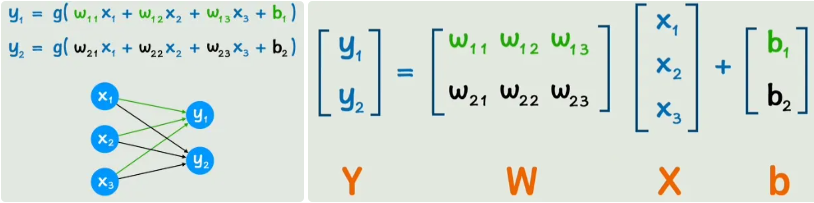

*图 14：一个小神经网络的展开式与矩阵表示*

这样原本复杂的式子就可以表示为简洁的矩阵乘法。

与此同时，当神经网络的层数越来越多的时候，也需要用合适的方法来表示。我们把输入层用 a[0] 表示，中间的层就用 a[1]、a[2] 来表示，以此类推。

第一层、第二层和通式如下所示。这样不仅我们看起来更简单、更抽象了，更有利于研究更深的问题了。同时，矩阵运算相比之前的式子，可以更好地利用 GPU 的并行运算特性，能加速神经网络的训练和推理过程。

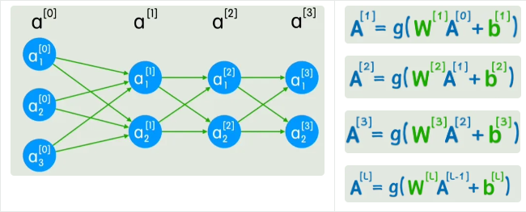

*图 15：层记号——输入层 a[0]、隐藏层 a[1]、a[2]……以及矩阵形式的通式*

我们再来看之前的神经网络，可以发现每一个节点都和前一层的所有节点相连接，这个并非神经网络所必需的，而这种连接方式叫做**全连接**。全连接层有一个显而易见的缺点，对于下面的这个例子，输入 900 个像素，在一个全连接层之后就需要 90 万个参数，并且这还只是把图像平铺开，不包含每个像素之间的位置关系，如果图片稍稍平移或改变一些局部信息，所有的神经元都会和之前不一样，这就是不能很好地理解图像的局部模式。

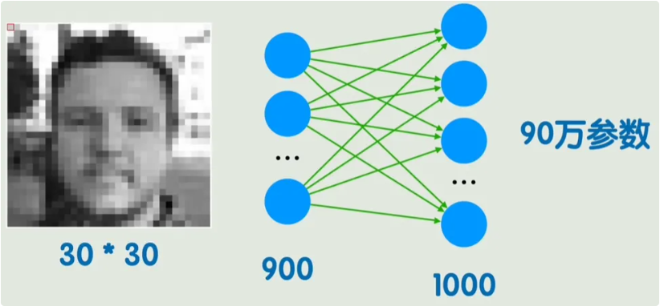

*图 16：全连接层的缺点——900 像素输入一层就要 90 万参数，且丢失位置关系*

那怎么办？我们在图像中取一个 3×3 的块，将它的灰度值与另一个矩阵做运算（对应位置相乘，最后求和），遍历整张图片的所有位置，得出的数值形成一个新的图像，这种方式就叫做**卷积运算**。刚刚给出的矩阵就叫做**卷积核**。

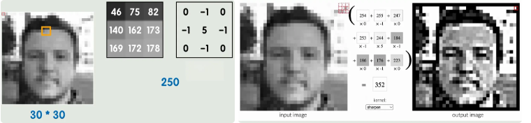

*图 17：卷积运算——3×3 图像块与卷积核逐位相乘求和，滑过全图*

卷积核早就被应用于传统图像处理领域，不同的卷积核可以达到不同的处理效果（轮廓、锐化、模糊）。但区别在于，图像处理中的卷积核是已知的，神经网络中我们用到的卷积核是未知的，它同样由参数构成。回到经典的神经网络结构，其实就是把一个全连接层替换为了卷积层，不仅能减少参数的数量，还能更有效地捕捉到图像中的局部信息。从公式上看，也就是把原来的矩阵标准乘法（叉乘）替换为了卷积运算。

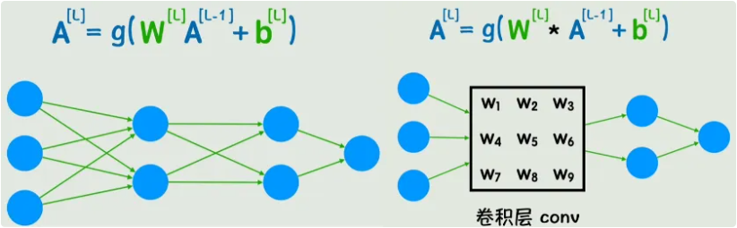

*图 18：把全连接层的矩阵乘法替换为卷积运算*

这样我们的神经网络示意图就能简化为新的形式。可以看到多出来一个**池化层**，池化层的作用是降低维度的同时保留主要特征，减少计算量。图中的卷积层、池化层、全连接层都可以有多个，而这种适用于图像识别领域的神经网络结构就叫做**卷积神经网络**（Convolutional Neural Network，CNN）。

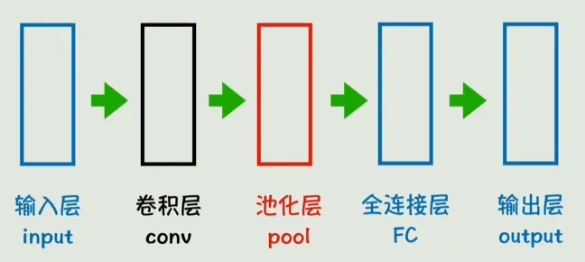

*图 19：CNN 结构——卷积层、池化层、全连接层依次堆叠（各层可有多个）*

但是卷积神经网络依旧有它的局限性，一般来讲它只适用于处理静态数据，对于时间序列、文本、视频、音频等动态数据，就需要其他的神经网络结构了。

## 五、循环神经网络 RNN（Recurrent Neural Network）

📺 对应视频：[P5 从词嵌入到 RNN](https://www.bilibili.com/video/BV1NCgVzoEG9?p=5)

之前的卷积神经网络适合处理图片信息，那文字信息怎么办呢？首先要明白，对于计算机，或者说神经网络来说，文字都是要转换为数字之后再进行处理的。那么我们要面对的第一个问题就是：如何将文字转换为数字。

有一种简单粗暴的方法：每一个文字或词组都用一个数字来代表，建一个非常大的映射关系表。

但这样有几个显而易见的缺点：第一，只用一个数字表示，不仅要建的表很大，维度也很低（只有一维）；第二，数字和数字之间无法表示字与字、词与词之间的联系。为了解决维度低的问题，有人提出了 one-hot 编码，即准备一个维度非常高的向量，每个字只有向量中一个位置是 1，其余全是 0。虽然维度低的问题被解决了，但是维度好像又太高了，并且依然没有解决之前的第二个问题。

那有没有能解决以上两种问题的方法呢？有的。这种方法就是**词嵌入**。

通过词嵌入的方式得到的词向量，维度不高不低，每个位置可以理解为一个特征值，但这个特征是通过训练得到的，我们并不知道代表着什么。那这种方式如何表示词与词之间的语义相关性呢？可以用两个向量的点积或余弦相似度来表示向量之间的相关性，进而表示词语之间的相关性。

**这样就将自然语言之间的联系转为可以用数学公式计算的方式。**同时，一些数学上的计算结果可能反映出一些很微妙的关系，例如一个训练好的词嵌入矩阵，很可能使得 桌子 − 椅子 = 鼠标 − 键盘。

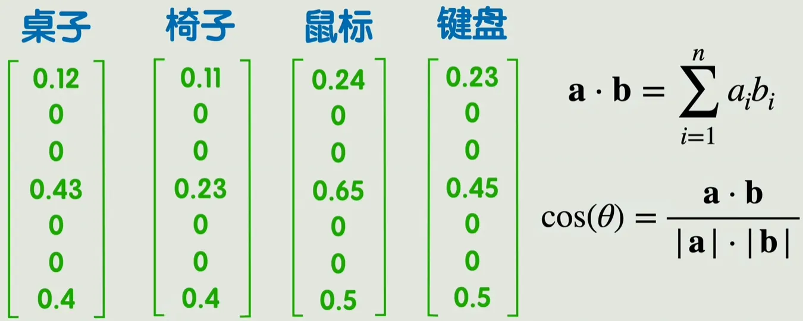

*图 20：词嵌入——维度适中的词向量，语义关系可用向量运算表达*

把所有词向量组成一个大矩阵，这个大矩阵就叫做**嵌入矩阵**，每一列表示一个词向量。矩阵中的值由训练得到，比较经典的方法是 word2vec，不展开讲解。虽然这样表示的维度比起 one-hot 已经大大下降，但是也超过了人能直接理解的二维、三维，我们管这些向量所在的空间叫做**潜空间**。我们无法理解潜空间中的位置关系，但是也有一些方法能够把潜空间降维至 2-3 维，方便我们直观看到词与词之间的关系。

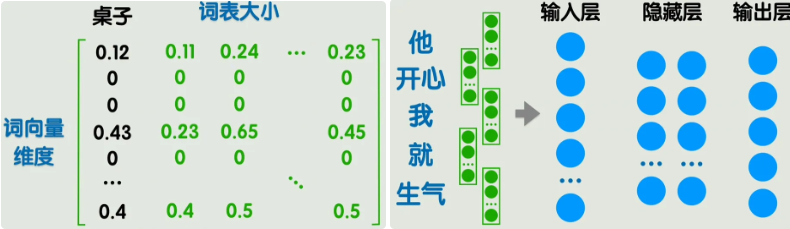

*图 21：嵌入矩阵（每列一个词向量）；潜空间可降维到 2-3 维便于观察*

这样我们的第一个问题就算是解决了，我们可以用词嵌入的方法将文本转为数据，但这样就可以了吗？举个例子，在右上方的图中，左边的五个词转为 5 个词向量，每个词向量假设为 300 维度，那么输入层就要有 1500 个神经元，当然是可以的，但是有两个新问题：

1. 输入层太大了，并且长度不固定；
2. 无法体现词语的先后顺序，参考之前无法体现图片像素的位置关系。在之前的图像处理中，我们可以通过卷积的方式来解决这一问题，那现在呢？

回到经典的神经网络，但是不是一次输入一句话，而是输入一个词。当然这里的 X、W 都是矩阵，之后不再展开。

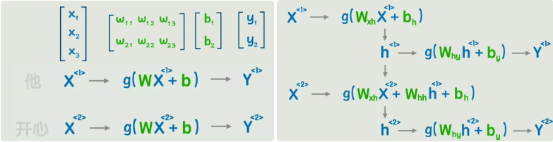

*图 22：整句输入 → 逐词输入，解决输入层过大、长度不固定的问题*

可以发现在第二个词的计算过程中，完全没有让第一个词的任何信息参与进来，怎么办呢？可以像右图这样，先输出一个隐藏状态，然后再经过一次非线性变换，得到输出 Y。这就是**循环神经网络 RNN**。

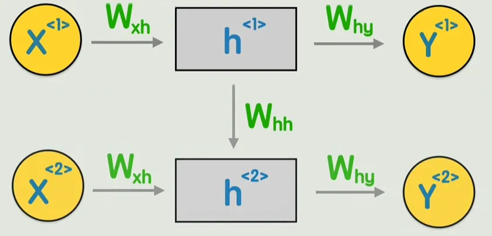

*图 23：RNN——每步先产生隐藏状态传给下一步，再非线性变换得到输出*

这个 RNN 模型就具备了理解词与词之间先后顺序的能力，可以判断一句话中各个单词的褒贬词性，还能给出一句话，不断生成下一个字，以及完成翻译等自然语言处理工作。

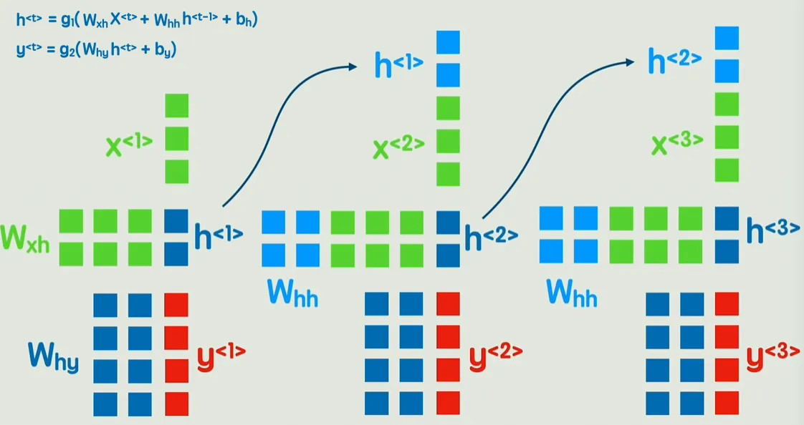

*图 24：RNN 的应用——情感判断、文本生成、机器翻译等*

那么 RNN 是否就完美了呢？当然不，RNN 依旧存在两个问题：

1. 信息会随着时间步的增多而逐渐丢失，无法捕捉长期依赖，而有的语句的关键信息恰好在很远的地方；
2. RNN 必须顺序处理，每个时间步必须依赖上一个时间步的隐藏状态的计算结果。

虽然有一些方法在改进以上两点问题，但是还不够好，那么是否有一个可以彻底抛弃按顺序计算的新方案呢？

有的兄弟，有的，那就是 Transformer！

## 六、Transformer 架构

📺 对应视频：[P6 简单而强大的 Transformer](https://www.bilibili.com/video/BV1NCgVzoEG9?p=6)

之前我们说过，对于输入神经网络的数据，要先转换为词嵌入。要解决之前提到的串行计算和长期依赖困难这两个问题，就要用到一种不同于之前的新方案——Transformer。

首先，为了让输入包含每个词之间的位置信息（前后顺序等），给每个词一个**位置编码**，表示这个词在整个句子中出现的位置，把这个位置编码加到原来的词向量中，现在这个词就有了位置信息。

但是现在每个词中还不包括和其他词的关系，注意不到其他词的存在，所以我们用几个新矩阵 Wq、Wk、Wv（训练得到）乘上每个词的词向量。当然，在计算机中运算时，是用 Wq、Wk、Wv 直接乘下方四个词向量拼成的大矩阵，然后直接得到三个矩阵（Q、K、V）。为了方便理解，还是拆分来看。

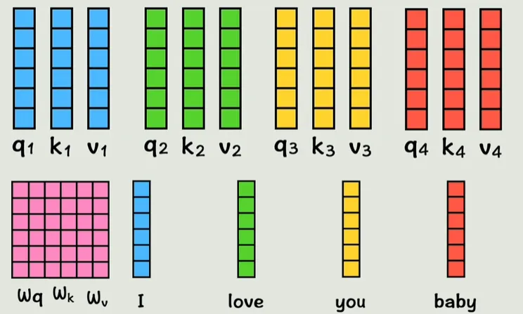

*图 25：Q、K、V——词向量分别乘以 Wq、Wk、Wv 三个训练得到的矩阵*

现在我们的词向量已经通过线性变换映射为了 QKV，维度不变，现在我们让 q1 和 k2 做点积，代表第一个词和第二个词的相似度，同理类推，得到的系数再与 v 相乘，最后相加，得到的 a1 就是包含了全部上下文信息的第一个词的新词向量。

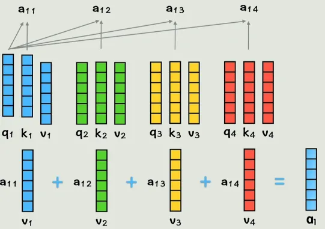

*图 26：注意力计算——q·k 点积得相似度系数，加权求和 v 得到 a1*

同理，我们得到了所有词的新词向量，每一个新词向量都包含了所有的上下文信息。这就是**注意力机制 attention** 所做的事情。

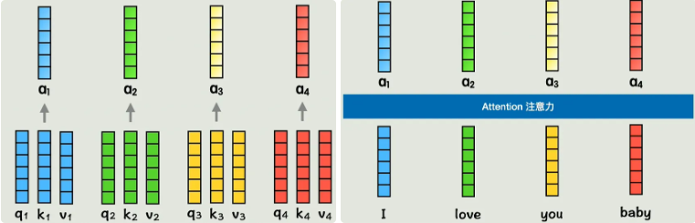

*图 27：每个新词向量都包含全部上下文信息*

但是两个词的关系并不是固定的，对于注意力机制来说，如果只通过一种方式计算一次相关性，灵活性就太低了。

所以我们可以增加这个数量，把之前得到的 QKV 通过两个权重矩阵计算得到两组新的 QKV，给每个词两个学习机会，每组 QKV 称为一个**头**。

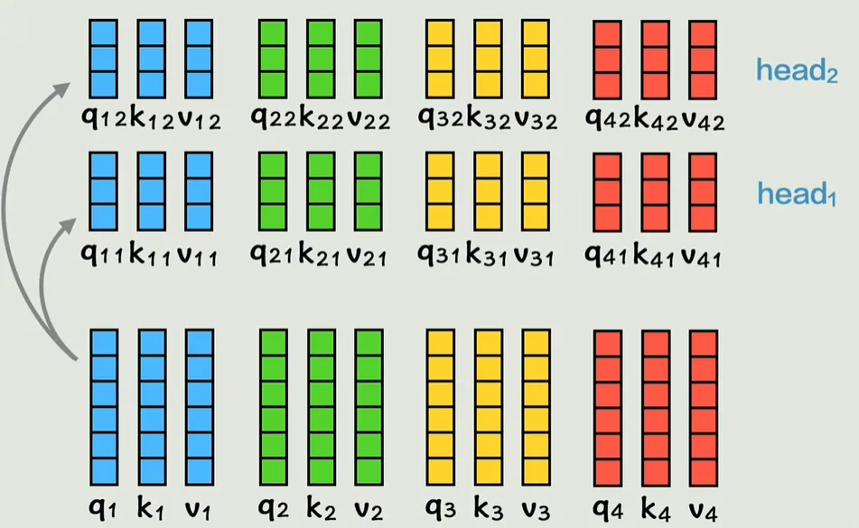

*图 28：多头注意力——每组 QKV 是一个头，给每个词多次学习机会*

再次通过之前的运算得到 a 向量，拼接起来就得到了和之前一样的结构。我们刚刚的例子有两个头，也属于多头注意力。

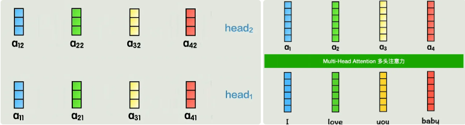

*图 29：各头的输出拼接，恢复成和单头一样的结构*

下图的左侧部分叫做**编码器**，右侧叫做**解码器**。

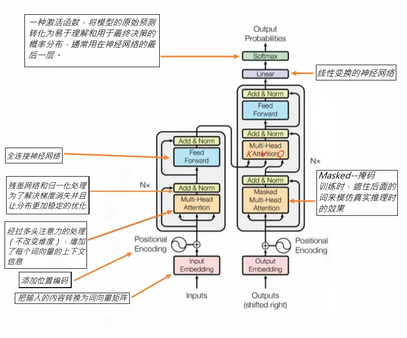

*图 30：Transformer 整体架构——左编码器、右解码器*

我们之前介绍的单头注意力和多头注意力都省略了一些步骤，详细的步骤和公式请看下图。

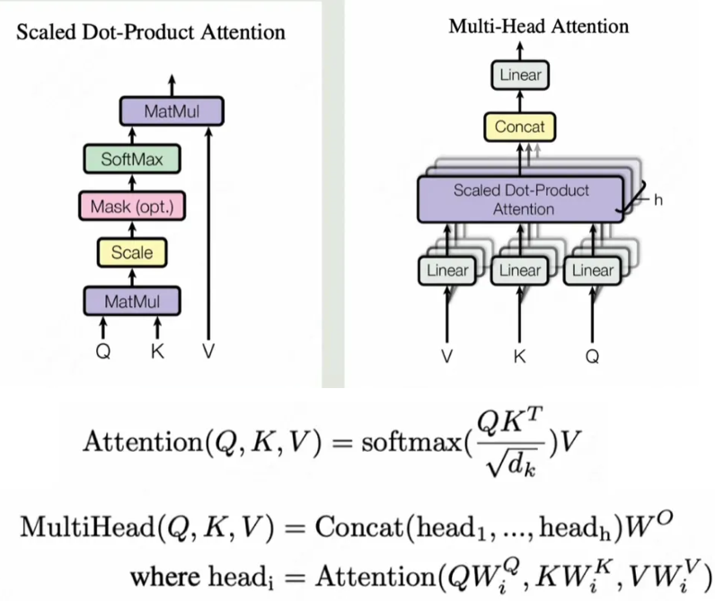

*图 31：单头/多头注意力的完整步骤与公式*

Over！

## 四种网络结构对比（收尾总结）

| 结构 | 适合的数据 | 核心思想 | 主要局限 |
| --- | --- | --- | --- |
| 全连接神经网络 | 小规模静态数据 | 线性变换 + 激活函数不断嵌套，理论上逼近任意连续函数 | 参数量爆炸；不理解输入的局部结构（如像素位置关系） |
| CNN 卷积神经网络 | 图像等静态数据 | 卷积核局部滑窗提取特征，池化降维保留主要信息 | 只适合静态数据，难以处理时间序列、文本等动态数据 |
| RNN 循环神经网络 | 时间序列、文本 | 隐藏状态在时间步之间传递，理解先后顺序 | 长期依赖信息丢失；必须串行计算，无法并行 |
| Transformer | 文本乃至各类模态 | 位置编码 + 多头注意力，一次算出全部词两两关系 | 结构和训练成本更高（原笔记未展开） |

一条主线串起来：**函数逼近**（联结主义）→ **神经网络**（层与激活函数）→ **训练**（损失函数 + 梯度下降 + 反向传播）→ **调教**（正则化 / Dropout / 提前终止）→ **图像专用**（CNN）→ **序列专用**（词嵌入 + RNN）→ **抛弃串行**（Transformer 注意力机制）。

## 附录

### 附录 A：术语表

| 术语 | 英文 | 一句话解释 |
| --- | --- | --- |
| 符号主义 | Symbolism | 早期 AI 路线：用精确的函数/符号规则表示一切 |
| 联结主义 | Connectionism | 不求精确函数，用网络找近似解 |
| 激活函数 | Activation Function | 套在线性变换外的非线性函数（平方、正弦、指数等），让网络能拟合曲线 |
| 神经元 | Neuron | 网络图中的一个小圈，计算的基本单位 |
| 隐藏层 | Hidden Layer | 输入层与输出层之间的中间层，负责特征提取和变换 |
| 前向传播 | Forward Propagation | 信号从输入层向输出层逐层计算的过程 |
| 损失函数 | Loss Function | 衡量预测值与真实值误差的函数，记为 L |
| 均方误差 | MSE, Mean Squared Error | 误差平方后按样本数平均，最常见的损失函数 |
| 梯度下降 | Gradient Descent | 参数沿梯度反方向不断调整，让损失函数变小 |
| 学习率 | Learning Rate | 控制每次参数调整步长的系数 |
| 梯度 | Gradient | 损失函数对各参数偏导数组成的向量 |
| 反向传播 | Backpropagation | 用链式法则从右向左逐层计算梯度并复用中间值 |
| 过拟合 | Overfitting | 模型太复杂，把噪声也学了进去 |
| 泛化能力 | Generalization | 模型在没见过的数据上的表现能力 |
| 数据增强 | Data Augmentation | 旋转、镜像、滤镜、裁剪现有数据来扩充训练集 |
| 提前终止 | Early Stopping | 在模型滑向过拟合之前停止训练 |
| 惩罚项 | Penalty Term | 加进损失函数里的参数本身或参数平方和 |
| 正则化 | Regularization | 用惩罚项抑制参数野蛮增长的方法 |
| 正则化系数 | Regularization Coefficient | 控制惩罚项力度的超参数 |
| 超参数 | Hyperparameter | 控制"参数怎么调"的参数（学习率、正则化系数等） |
| Dropout | Dropout | 每次训练随机丢弃一部分参数，避免过度依赖 |
| 全连接 | Fully Connected | 每个节点与上一层所有节点相连的方式 |
| 卷积运算 | Convolution | 取图像小块与卷积核对应相乘求和，滑过全图 |
| 卷积核 | Convolution Kernel | 卷积用的小矩阵；在神经网络中由训练得到 |
| 池化层 | Pooling Layer | 降低维度、保留主要特征、减少计算量 |
| 卷积神经网络 | CNN | 卷积层 + 池化层 + 全连接层，适合图像识别 |
| one-hot 编码 | One-hot Encoding | 超高维向量，只有词对应位置为 1 其余为 0 |
| 词嵌入 | Word Embedding | 把词映射为维度适中的向量，经典方法 word2vec |
| 嵌入矩阵 | Embedding Matrix | 所有词向量拼成的大矩阵，每列一个词向量 |
| 潜空间 | Latent Space | 词向量所在的高维空间，可降维可视化 |
| 循环神经网络 | RNN | 隐藏状态随时间步传递，能理解词序 |
| 隐藏状态 | Hidden State | RNN 中每个时间步输出并传给下一步的中间向量 |
| 位置编码 | Positional Encoding | 加到词向量上、表示词在句中位置的编码 |
| Q、K、V | Query / Key / Value | 词向量分别乘 Wq、Wk、Wv 得到的三组向量 |
| 注意力机制 | Attention | q·k 点积算相似度，加权求和 v，让每个词带上全部上下文 |
| 多头注意力 | Multi-head Attention | 多组 QKV（多个头）分别算注意力再拼接 |
| 编码器 / 解码器 | Encoder / Decoder | Transformer 架构图的左半部分 / 右半部分 |

### 附录 B：原笔记勘误表

整理时对原笔记的以下笔误做了修正（正文已改，此处留档）：

| 原文 | 修正为 | 位置 |
| --- | --- | --- |
| 用减去，再套上绝对值 | 用**预测值**减去**真实值**，再套上绝对值 | 第二章·损失函数 |
| 偏导数**地**反方向 | 偏导数**的**反方向 | 第二章·梯度下降 |
| 这样原本复杂的式子就可以表示为。 | ……表示为简洁的矩阵乘法。（原句缺宾语，疑漏公式） | 第四章·矩阵表示 |
| 在图像中**去**一个 3×3 的块 | 在图像中**取**一个 3×3 的块 | 第四章·卷积运算 |
| 将**他**的灰度值 / **他**同样由参数构成 | 将**它**的灰度值 / **它**同样由参数构成 | 第四章·卷积运算 |
| 每次训练时都**随即**丢弃 | 每次训练时都**随机**丢弃 | 第三章·Dropout |
| 矩阵标准乘法（叉乘） | 严格说矩阵乘法≠叉乘（cross product），此处指标准矩阵乘法（点乘/矩阵积） | 第四章·卷积层 |
| 这里简单提一下，留待补充。 | 将原图 13 转写为"四类问题+解决办法"表格补入正文，并保留"继续补充"的说明 | 第三章·其他遗留问题 |

### 附录 C：视频嵌入代码速查

本文使用的 B 站官方 iframe 嵌入代码（`p=1` 可换成任意分 P；`danmaku=0` 关闭弹幕，`autoplay=0` 禁止自动播放）：

```html
<iframe src="https://player.bilibili.com/player.html?isOutside=true&bvid=BV1NCgVzoEG9&p=1&autoplay=0&danmaku=0"
        width="100%" height="468"
        scrolling="no" border="0" frameborder="no" framespacing="0" allowfullscreen="true"
        loading="lazy"></iframe>
```

例如只想在"Transformer 架构"一节嵌入 P6，把 `p=1` 改成 `p=6` 即可：

```html
<iframe src="https://player.bilibili.com/player.html?isOutside=true&bvid=BV1NCgVzoEG9&p=6&autoplay=0&danmaku=0"
        width="100%" height="468"
        scrolling="no" border="0" frameborder="no" framespacing="0" allowfullscreen="true"
        loading="lazy"></iframe>
```

> 注：B 站嵌入播放器需要联网加载，在本地离线预览 Markdown 时不会显示，部署到博客后正常。分 P 对照：P1 从函数到神经网络 / P2 计算神经网络的参数 / P3 调教神经网络的方法 / P4 从矩阵到 CNN / P5 从词嵌入到 RNN / P6 简单而强大的 Transformer / P7 速览大模型 100 词。
