# 《数字滤波器究竟如何使用》学习笔记

> 整理依据：视频原文转录 + 配套 PPT（16 页），配图即 PPT 页面截图。
> 主线：**先建立宏观认识，再抠细节**——滤波器不像书上写的那么玄，随手一写就是一个滤波器；但要做到"定量设计"，才需要书上那一整套方法。
> 转录稿为语音识别产物，错别字较多，本笔记已按 PPT 与专业术语校正（对照表见附录）。

---

## 0. 一页速览（宏观框架）

| 问题 | 答案 |
|---|---|
| 滤波器是什么 | 一段"数据加工规则"：把输入序列按某种规则映射成输出序列，随手写的平滑代码就是滤波器 |
| 两大家族 | **FIR**（有限长冲激响应）／**IIR**（无限长冲激响应） |
| 最直观的判别法 | 输出**只**取决于过去的输入 → FIR；输出**还**取决于过去的输出（有反馈/递归）→ IIR |
| IIR 设计链 | 技术指标 → 模拟滤波器 H(s) → 转成数字 H(z) → 差分方程 → 网络图 → 程序 |
| 模拟→数字三种转换 | 冲激不变法、阶跃不变法（都有混叠，不能转高通）；双线性变换法（无混叠、可转高通，但必有频率畸变） |
| FIR 设计链 | 理想滤波器做 Z 反变换得无限长 h_d(n) → **加窗截断** → h(n) = h_d(n)·w(n) → 验算频率响应 |
| FIR 最大卖点 | **线性相位**（条件：系数关于中心对称） |
| 性能对比 | FIR：线性相位、更稳定；IIR：相同阶数下幅频特性更好（更陡峭） |

---

## 1. 滤波器没那么神秘：两个上手例子

### 1.1 例一：激光雷达测距的"零值坑"（最简单的滤波器）

- 项目背景：用激光雷达模组（TFmini Plus）测距，读到的距离数据里会**突兀地出现一些零值点**。
- 查数据手册（5.4 输出数据说明）找到原因：
  - Dist 为测量距离值，默认单位 cm，十进制范围 0–1200；
  - 当信号强度 **Strength < 100 或等于 65535** 时，Dist 被认为不可信，**默认输出 0**。
- 对策（一个 if 就是滤波器）：

```text
如果本次读数为 0 → 本次距离 = 上一点的距离
```

- 效果：所有"坑"被填平。非常简单，但非常好用——这就是一个最最简单的滤波器。

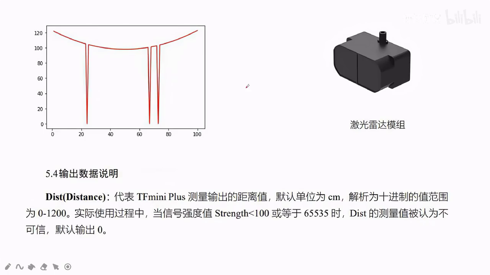

### 1.2 例二：抖动数据的三点平均（随手写出 FIR 和 IIR）

- 场景：雷达测距结果非常抖动，想让它平滑些。真实数据已丢失，用 Python 模拟：
  - 100 个数；真实波形为二次函数 `y = 0.01*x**2 - x + 123`，再叠加高斯噪声。
- 朴素想法：抖动 → 取平均。用**上一次、本次、下一次**三个数的平均代替中间那点。
- 两种写法（灵光一闪写哪种是哪种，背后原因当时并不知道）：

```python
import numpy as np
from matplotlib import pyplot as plt

x = np.linspace(1, 100, 100)
y = 0.01*x**2 - x + 123
y = y + np.random.randn(len(x))        # 叠加噪声
plt.plot(x, y, label='original')

# 写法一：新建数组存结果 —— 输出只从"输入"里取数 → FIR
y2 = np.zeros((100))
y2[0]  = y[0]
y2[99] = y[99]
for i in range(98):
    y2[i+1] = (y[i] + y[i+1] + y[i+2]) / 3
y2 = y2 + 10                            # 整体上移，便于画图对比
plt.plot(x, y2, label='FIR')

# 写法二：原地修改 —— 算出的输出会进入后续计算 → IIR
for i in range(98):
    y[i+1] = (y[i] + y[i+1] + y[i+2]) / 3
y = y + 10
plt.plot(x, y, label='IIR')
plt.legend()
plt.show()
```

- 效果：能消掉一部分抖动，两种写法都"能用"（下图中橙色为 FIR、绿色为 IIR，都比蓝色原始曲线平滑）。
- 对照课本才恍然大悟：**写法一是 FIR，写法二是 IIR**。不要把它想得特别复杂——随手一写就写出了两种滤波器；但也不要想得太简单——见 1.3。

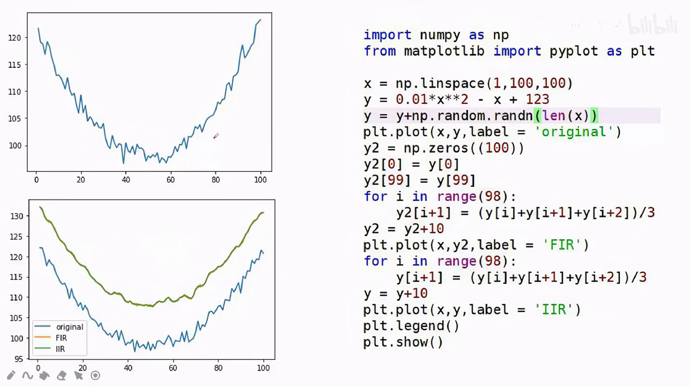

### 1.3 那为什么还要学书上复杂的设计方法？

- 手写滤波器只能**定性、粗略**地产生效果，没法回答定量问题，例如：
  - "设计一个低通滤波器处理语音信号，要求**保留 1 kHz 以下**的信号"——给定定量指标，能不能完成？
  - 实际工程中对数据做**傅里叶变换**，发现有用信号是一个平台、另有一个高频噪声频带，想设计一个专门滤除该噪声频带的滤波器（幅频特性要长成对应的形状）——怎么给出并满足定量指标？
- 只有书上的方法才能**定量地描述、定量地设计**一个滤波器。

---

## 2. FIR 与 IIR 的本质区别

### 2.1 名字本义

- **FIR**：Finite Impulse Response，**有限长**冲激响应；
- **IIR**：Infinite Impulse Response，**无限长**冲激响应。

### 2.2 最直观的判别方式（PPT 原话）

> 看滤波器的输出**是否只取决于之前的输入，有没有取决于之前的输出**：
> - 只取决于之前的输入 → **FIR**；
> - 还取决于之前的输出 → **IIR**。

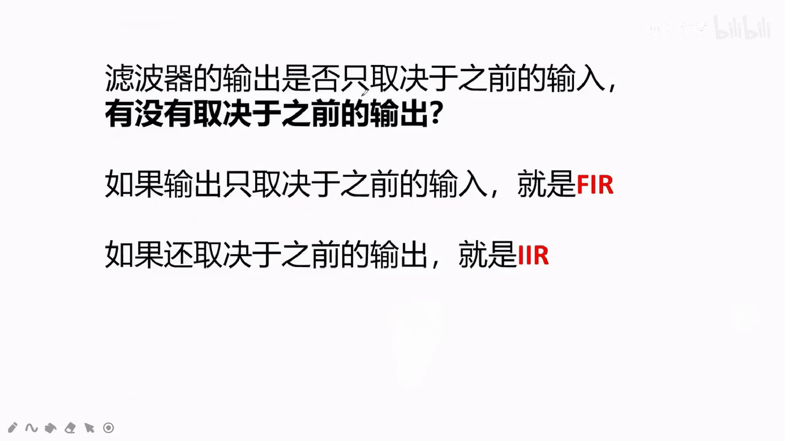

- 对应例二：
  - 写法一（新数组）：每一项都从**输入**里取三个数求平均，与之前算出的输出毫无关系 → FIR；
  - 写法二（原地操作）：推演一下——i=0 时先算出 y1=(y0+y1+y2)/3；i=1 时算 y2，公式里的一项 y1 **已经是刚才算出的输出**。之前算出的输出影响了之后的输出（反馈/递归）→ IIR。

### 2.3 冲激响应实验：把"有限/无限"看出来

- **冲激信号**：100 个数中只有第 50 个非零（=100），其余 99 个全为 0。
- 把冲激信号送入滤波器，**输出就是冲激响应**。代入例二两个滤波器：
  - **FIR 的冲激响应**（中图）：只有冲激位置附近两三个点非零（≈100/3），其余全 0 → 有限长。
    - 原因很好懂：输出只由周围 3 个输入决定，只有跟第 50 个点"沾上边"的那几步输出才非零。
  - **IIR 的冲激响应**（右图）：一个尖峰后拖一条**指数衰减的长尾**。图上后面"像是变成 0"，其实只是数太小；放大看全都有值，**一直到无穷都是非零** → 无限长。
    - 原因：输出一旦非零，就会作为"之前的输出"反馈进后续计算，一步影响下一步，**影响永远无法消除**。

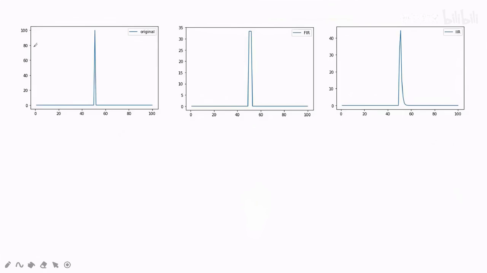

---

## 3. IIR 滤波器的设计

### 3.1 从指标到代码的完整链条

```text
技术指标(截止频率、衰减系数…) → H(z) → 差分方程 → 网络图 → 程序
```

- H(z) 是传递函数：H(z) = Y(z)/X(z)；
- 把分母乘到左边（若干倍的 Y(z) = 若干倍的 X(z)），再做 **Z 反变换**（z → n），把 y(n) 提出来 → **差分方程**；
- 差分方程填入**网络图**（延时单元 z⁻¹、乘法器、加法器）：x(n) 走前馈支路（系数 b0, b1, b2…），y(n) 走反馈支路（系数 −a1, −a2…）；
- 网络图可以**唯一地**推出程序（一种比较规范、"万能"的直译式编程风格，区别于例二那种卷积式随手写法）。

### 3.2 书上例题

传递函数：

```text
        8 − 4z⁻¹ + 11z⁻² − 2z⁻³
H(z) = ───────────────────────────
        1 − (5/4)z⁻¹ + (3/4)z⁻² − (1/8)z⁻³
```

差分方程（移项 + Z 反变换）：

```text
y(n) = 8x(n) − 4x(n−1) + 11x(n−2) − 2x(n−3)
       + (5/4)y(n−1) − (3/4)y(n−2) + (1/8)y(n−3)
```

- 系数对应：b0=8, b1=−4, b2=11, b3=−2；反馈项 5/4、−3/4、1/8（分母移到等号右边时变号）。

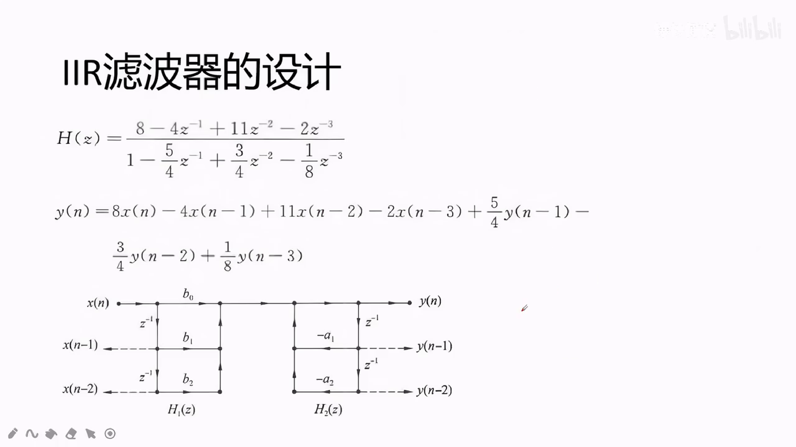

- 对应程序（**先算输出，再统一移位更新状态变量**，移位就是延时 z⁻¹）：

```python
x_1, x_2, x_3, y_1, y_2, y_3 = 0, 0, 0, 0, 0, 0

def filter(x):
    global x_1, x_2, x_3, y_1, y_2, y_3
    y = (8*x - 4*x_1 + 11*x_2 - 2*x_3
         + 1.25*y_1 - 0.75*y_2 + 0.125*y_3)
    x_3 = x_2          # 以下六行：参数更新 = 做一次延时
    x_2 = x_1
    x_1 = x
    y_3 = y_2
    y_2 = y_1
    y_1 = y
    return y

for i in range(100):
    y3[i] = filter(y[i])
```

- 运行现象：开头有一个**很大的震荡**（输出先冲到约 4900 再回落收敛）——这是 IIR 的突出特征：**反馈可能导致不稳定**；若震荡越来越大就永远无法稳定。本例最终稳定下来了。

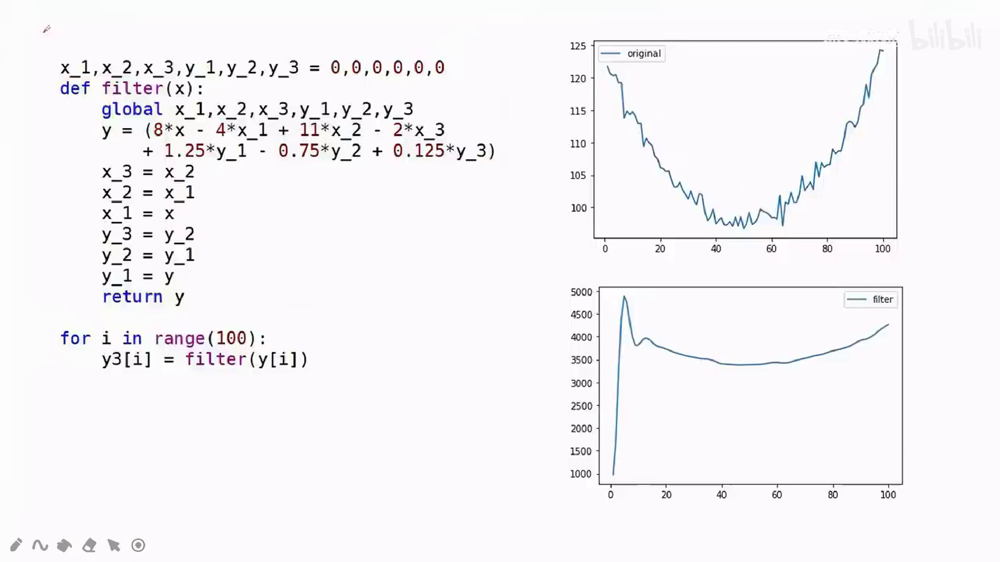

### 3.3 核心任务变成：怎么设计出 H(z)？

- 最经典的路线：**先设计模拟滤波器 H(s)，再转换成数字滤波器 H(z)**（此外也有直接设计法）。
- 这条路线的两个好处：
  1. **技术指标来自现实世界**，现实世界本身就是模拟的形式，贴近指标；
  2. **好"抄答案"**：巴特沃斯（Butterworth）、切比雪夫（Chebyshev）等经典设计现成可套——下图即模拟低通幅频特性（图 6.6）、巴特沃斯幅频特性与 Ω 和 N 的关系（图 6.7）、巴特沃斯归一化低通滤波器极点参数表（表 6.1），效率最高。具体代公式的步骤书上有明确做法。

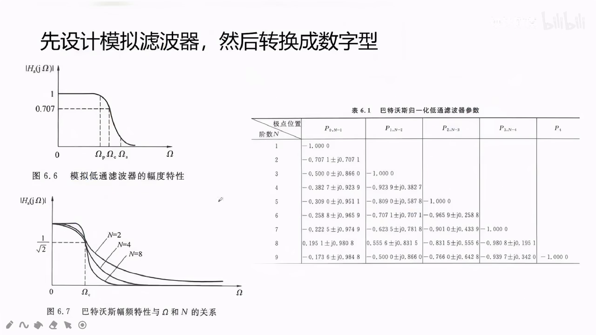

### 3.4 模拟 → 数字的三种转换法

> 先认清本质：三种办法**全都是数学上的游戏**——不涉及真实电路或程序，纯粹是数学上把 H(s) 映射成 H(z)，各自**附加一个条件/假设**把过程合理化。

#### (1) 冲激不变法

- 附加的假设：把信号拆解成一个个冲激分别采样、分别输入；**"模拟滤波器冲激响应的采样" = "数字滤波器的冲激响应"**。
- 若假设成立，转换完全精确；但实际很可能不成立：
  - 采样**采不到高于抽样频率一半**的频率分量（混叠）；冲激响应若含高频分量就测不准。
- 典型后果：**冲激不变法没法转换高通滤波器**（高通的冲激响应很高频，采样必失真）。

#### (2) 阶跃不变法

- 把"产生冲激信号"换成"产生阶跃信号"，思路与冲激不变法相同，**没有本质区别**，同样有混叠问题。

#### (3) 双线性变换法

- **前置知识：数字角频率 ω 与模拟角频率 Ω 的区别**
  - 频率响应的几何表示法（下图）：在 z 平面单位圆 |z|=1 上取点 B=e^(jω)，
    |H(jω)| = |A| · (各**零点** c_i 指向 B 的向量长度之积) / (各**极点** d_k 指向 B 的向量长度之积)；
  - 由此画出的曲线横坐标是 ω，**到 2π 就结束**（周期 2π）：
    - ω 的 0~π 对应模拟的 0~(抽样频率/2)；由抽样定理，只有这一段有意义；
    - **π 对应抽样频率的一半**（奈奎斯特频率）；π~2π 与 0~π 对称，没有独立意义；
  - 而真实世界的频率（1000 Hz、2000 Hz…）换算成模拟角频率 Ω 可以非常大、直到无穷——两套频率需要映射关系。

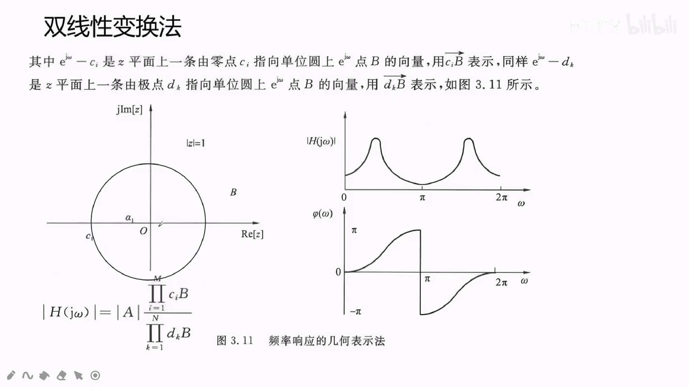

- 双线性变换做的事：**改换 ω 与 Ω 的对应关系**
  - 原来：Ω ∈ [0, 抽样频率/2] ↔ ω ∈ [0, π]（低频段近似线性）；
  - 变换后：把 **Ω ∈ [0, ∞) 整个无限长的轴压缩**进 ω ∈ [0, π]。
  - 名字叫"双线性"，**实际上跟线性一点关系都没有**，是典型的**非线性**变换。
- 优点：解决了前两种方法的问题——**可以转换高通滤波器**，高频也不产生混叠失真。
- 缺点：因为压缩映射本身非线性，**任何**模拟→数字转换都会产生幅频特性的畸变（频率 warped）；冲激不变法至少在低频段还是线性的、不失真，双线性变换则是**全频段必失真**。

---

## 4. FIR 滤波器

### 4.1 最大卖点：线性相位

- **相位是频域说法，换到时域就是延时**。线性相位 = 线性延时：把输出整体延时固定几个单位，就能与原信号相位完全对齐（波形不变形）。
- 用两段 5 点平均程序对比（下图）：

```python
# 版本 A：实时（因果）版 —— 只用当前和过去的输入
y2 = np.zeros((100))
y2[0], y2[1], y2[2], y2[3] = y[0], y[1], y[2], y[3]
for i in range(96):
    y2[i+4] = (y[i]+y[i+1]+y[i+2]+y[i+3]+y[i+4]) / 5   # 输出时刻 i+4 只用 ≤ i+4 的输入

# 版本 B：居中（零相位）版 —— 需要"未来"的输入
y3 = np.zeros((100))
y3[0], y3[1], y3[98], y3[99] = y[0], y[1], y[98], y[99]
for i in range(96):
    y3[i+2] = (y[i]+y[i+1]+y[i+2]+y[i+3]+y[i+4]) / 5   # 输出时刻 i+2 用到了 i+3、i+4 的输入
```

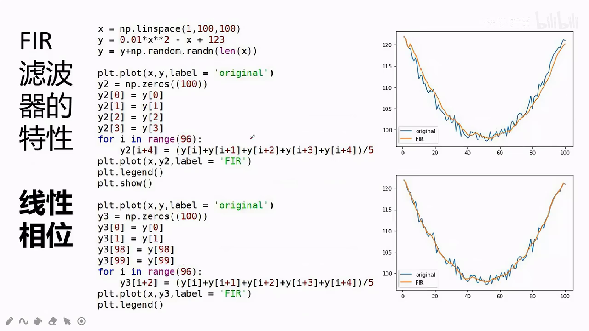

- 现象与解释：
  - 版本 B 的输出沿输入信号上下跳动，**相位差 ≈ 0**：系数前后对称（1,1,1,1,1），过去与未来的影响相同、相互抵消，只剩中间时刻的响应；
  - 版本 A 满足实时性/因果性，但输出**整体向左偏固定的格数（约 2 个单位）**：它只受前面 4 个时刻影响、受不到后面的影响 → 向过去偏移。这个固定偏移就是**线性相位**（固定延时）；
  - 补救：把版本 A 的输出**向后延时 2 个单位**即可对齐（在输出端延时，或全部算完后再统一延时，都可以）。
- 关于"非因果"这个译名的吐槽：它容易给人"违背因果律、像造时间机器"的错觉；其实**任何非实时（离线）系统都能用未来输入算当前输出**。所以用"**实时性**"来描述比"因果性"更贴切：要实时输出，就绝不能用下一刻的输入。
- **注意：不是所有 FIR 都能线性相位！** 条件：系数**关于中心对称**——
  - 偶对称或奇对称 × 奇数个或偶数个系数 = 四种情况，但**无论如何必须对称**。
  - 反例理解：把对称序列中某个系数改成 2 而镜像位置不改，前后影响不再抵消，**无论延时多少单位都补不回来** → 失去线性相位；把镜像位置也补成 2，就恢复线性相位。

### 4.2 FIR 的设计：理想滤波器反变换 + 加窗（比 IIR 简单）

- 不需要套巴特沃斯/切比雪夫等模拟原型，**不需要模拟→数字转换**。
- 步骤：
  1. 写出**理想滤波器**的频率特性，做 **Z 反变换**（逆离散时间傅里叶变换）得到 h_d(n)——必然是**无限长**的冲激响应；
  2. 既然是 FIR，就要**截取一段**：截断本身就是加窗。**矩形窗**＝窗内原样保留（=1）、窗外直接抛弃（=0）；
  3. 截得的序列**直接拿来当系数**用。例如截出 (1, 2, 3, 2, 1)，就直接写进程序（是否整体除以 5 只影响增益，不影响线性相位与幅频形状）；
  4. 一般化：h(n) = h_d(n)·w(n)（时域逐点相乘），w(n) 为窗函数；
  5. 计算频率响应验算是否达标：H(jω) = Σ_{n=0}^{N−1} h(n)·e^(−jωn)。
- 常见窗函数（下图 7.11 五种）：**矩形窗、三角窗、海明窗（Hamming）、汉宁窗（Hanning）、布莱克曼窗（Blackman）**。
- 加窗的目的：让"截了一段"的滤波器的幅频特性**尽可能接近**理想无限长滤波器。完全还原不可能（一段有限长永远不等于无限长），各种窗就是科学家们研究出来的"尽可能还原"的方案。

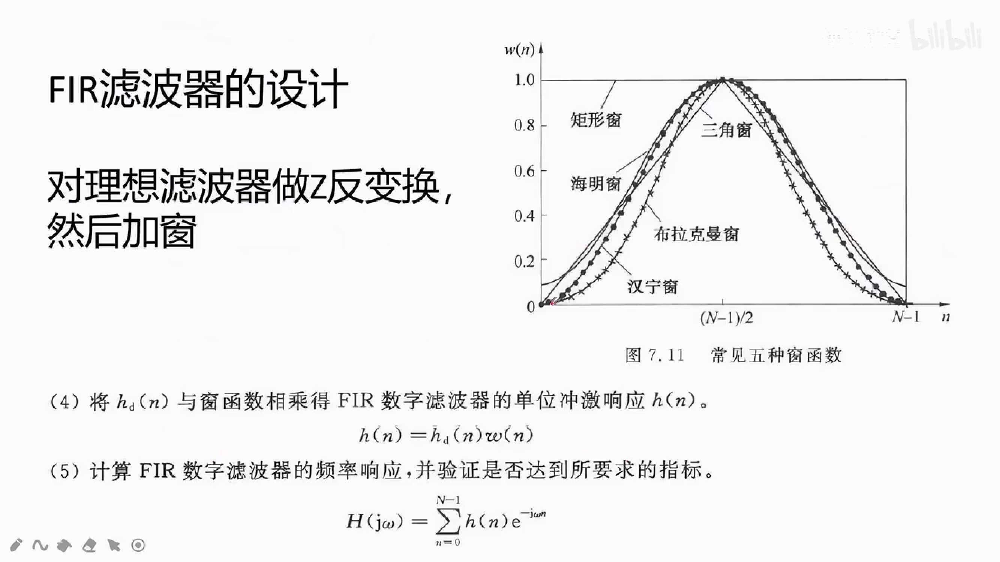

### 4.3 为什么 IIR 做不到线性相位、还可能不稳定

- **相位**：IIR 原地递归——这次算出的 y(i+4) 会进入下一次的算式，影响层层叠加、无限传递，最后"弄不明白到底受了多少影响"；不像 FIR 能明确分辨"受前面一半、后面一半影响"从而用固定延时抵消。IIR 的相位影响**理论上可补偿，但很难消除**。
- **稳定**：IIR 有反馈回路，震荡可能越来越大 → 可能不稳定（见 3.2 的开机大震荡）；FIR 无反馈，**天然更稳定**。

---

## 5. IIR 与 FIR 性能差别总结（PPT 原三条 + 展开）

1. **FIR 可以做到线性相位**（IIR 很难）；
2. **FIR 更加稳定**（IIR 有反馈，可能不稳定）；
3. **相同阶数下，IIR 幅频特性更好**：过渡带更陡峭，低通/高通曲线更接近理想。

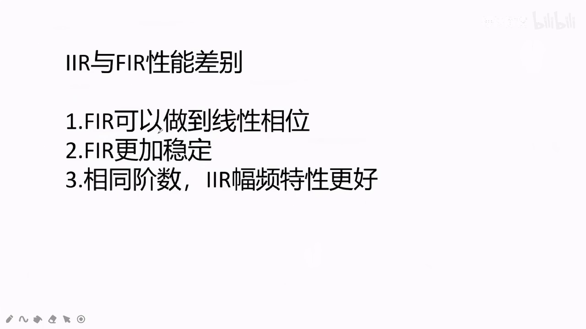

- "阶数"的含义：程序中取的状态变量个数，如一共 6 个变量就是 6 阶。
- FIR 想达到同样的幅频效果 → **阶数必须更大**，代价：
  - 占内存多（更多变量）；
  - 每个系数每步都要一次乘法 + 一次加法 → **运算量大很多**。

| 对比项 | FIR | IIR |
|---|---|---|
| 相位 | 可严格线性相位（系数对称即可） | 非线性相位，难补偿 |
| 稳定性 | 无反馈，总是稳定 | 有反馈，可能不稳定 |
| 相同阶数幅频特性 | 较缓 | 更陡峭、更好 |
| 达到同等指标的代价 | 阶数高 → 内存多、乘加运算量大 | 阶数低、运算量小 |
| 设计路线 | 理想反变换 + 加窗 | 模拟原型（巴特沃斯/切比雪夫）+ 三种转换法 |
| 典型实现结构 | 卷积式（新数组） | 递归式（原地/状态变量反馈） |

---

## 6. 收尾

- 本期的定位：**宏观认识**。光有这些还不足以做题，只是先建立框架，之后细学设计公式时知道"每一步在干什么"。
- 下期预告：挑题精讲——这两章（IIR/FIR 设计）的题具体怎么做。

---

## 附录：转录稿语音识别纠错对照表

| 转录稿原文 | 正确术语 |
|---|---|
| 有现场 / 线程 / 有限长重叠响应 | 有限长（冲激响应），FIR |
| 无线长 / 无限程 / 无线充电响应 | 无限长（冲激响应），IIR |
| 负面特性 / 扶贫特性 / 复面 | 幅频特性 |
| 中央 / 重阳 / 同样频率 | 抽样（频率） |
| 冲击不变法 / 冲击波变法 / 公积不变 | 冲激不变法 |
| 节约不变法 | 阶跃不变法 |
| 双星的变化法 | 双线性变换法 |
| 湿疹 / "一定会是真" | 失真（频率畸变） |
| 非英国 | 非因果 |
| 岩石 / 线性岩石 | 延时 / 线性延时 |
| 线性相对 | 线性相位 |
| 负列变换 / 复利变换 | 傅里叶变换 |
| 食欲上 | 直观上 |
| 床 / 加床 / 好几种床 | 窗 / 加窗 / 好几种窗 |
| 接触（"相同接触"） | 阶数（相同阶数） |
| 套……滤波器的一个皮 | 套……滤波器的模板/原型 |
| iphone r / IIIR / IRIR | IIR |
| FR 滤波器 | FIR 滤波器 |
| 万能的网络结构 | 通用（直译式）网络结构 |
| 收取的大一些 | （把取值范围/坐标）放大一些 |
